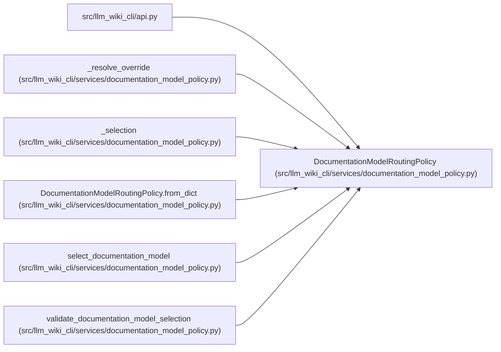

# DocumentationModelRoutingPolicy

**Location:** `src/llm_wiki_cli/services/documentation_model_policy.py:253`
**Kind:** Class
**Bases:** —
**Module:** [documentation_model_policy](../modules/documentation_model_policy.md)

**Decorators:** `@dataclass(frozen=True)`

## Description

Complete low-cost-first routing configuration for wiki updates.

## Attributes

| Name | Type | Default | Description |
|------|------|---------|-------------|
| `routes` | `tuple[DocumentationModelRoute, ...]` | *required* | — |
| `mode_defaults` | `Mapping[str, str]` | *required* | — |
| `escalation_rules` | `tuple[DocumentationModelEscalationRule, ...]` | `()` | — |
| `schema_version` | `str` | `DOCUMENTATION_MODEL_ROUTING_SCHEMA_VERSION` | — |

## Methods

| Method | Signature | Decorators | Description |
|--------|-----------|------------|-------------|
| `__post_init__` | `() -> None` | — | — |
| `policy_hash` | `() -> str` | `@property` | Return the stable hash used to audit a selection. |
| `route_for_reference` | `(reference: str) -> DocumentationModelRoute` | — | Resolve a route id or configured alias without provider assumptions. |
| `to_dict` | `() -> dict[str, Any]` | — | — |
| `to_json` | `() -> str` | — | Return canonical JSON suitable for hashing and checked-in policy files. |
| `from_dict` | `(payload: Mapping[str, Any]) -> 'DocumentationModelRoutingPolicy'` | `@classmethod` | — |

## Relationships

<!-- Auto-generated relationship summary. Do not edit by hand. -->

### Summary

| Module | Methods | Attributes |
|---|---:|---|
| [documentation_model_policy](../modules/documentation_model_policy.md) | 6 | `escalation_rules`, `mode_defaults`, `routes`, `schema_version` |

### References

| Reference | Kind | Source | Call sites |
|---|---|---|---:|
| `api` | import | [api](../modules/api.md) | — |
| `_resolve_override` | type_reference | [documentation_model_policy](../modules/documentation_model_policy.md) | — |
| `_selection` | type_reference | [documentation_model_policy](../modules/documentation_model_policy.md) | — |
| `DocumentationModelRoutingPolicy.from_dict` | type_reference | [documentation_model_policy](../modules/documentation_model_policy.md) | — |
| `select_documentation_model` | type_reference | [documentation_model_policy](../modules/documentation_model_policy.md) | — |
| `validate_documentation_model_selection` | type_reference | [documentation_model_policy](../modules/documentation_model_policy.md) | — |
