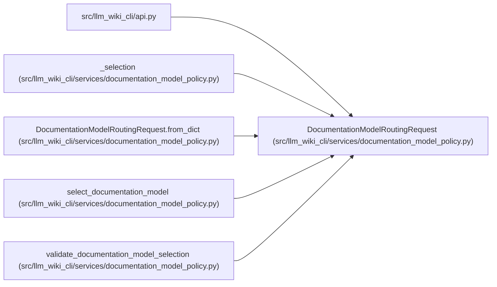

# DocumentationModelRoutingRequest

**Location:** `src/llm_wiki_cli/services/documentation_model_policy.py:501`
**Kind:** Class
**Bases:** —
**Module:** [documentation_model_policy](../modules/documentation_model_policy.md)

**Decorators:** `@dataclass(frozen=True)`

## Description

One credential-free request to choose a wiki-update agent model.

## Attributes

| Name | Type | Default | Description |
|------|------|---------|-------------|
| `mode` | `str` | *required* | — |
| `signals` | `tuple[str, ...]` | `()` | — |
| `override` | `DocumentationModelOverride \| None` | `None` | — |

## Methods

| Method | Signature | Decorators | Description |
|--------|-----------|------------|-------------|
| `__post_init__` | `() -> None` | — | — |
| `to_dict` | `() -> dict[str, Any]` | — | — |
| `from_dict` | `(payload: Mapping[str, Any]) -> 'DocumentationModelRoutingRequest'` | `@classmethod` | — |

## Relationships

<!-- Auto-generated relationship summary. Do not edit by hand. -->

### Summary

| Module | Methods | Attributes |
|---|---:|---|
| [documentation_model_policy](../modules/documentation_model_policy.md) | 3 | `mode`, `override`, `signals` |

### References

| Reference | Kind | Source | Call sites |
|---|---|---|---:|
| `api` | import | [api](../modules/api.md) | — |
| `_selection` | type_reference | [documentation_model_policy](../modules/documentation_model_policy.md) | — |
| `DocumentationModelRoutingRequest.from_dict` | type_reference | [documentation_model_policy](../modules/documentation_model_policy.md) | — |
| `select_documentation_model` | type_reference | [documentation_model_policy](../modules/documentation_model_policy.md) | — |
| `validate_documentation_model_selection` | type_reference | [documentation_model_policy](../modules/documentation_model_policy.md) | — |
