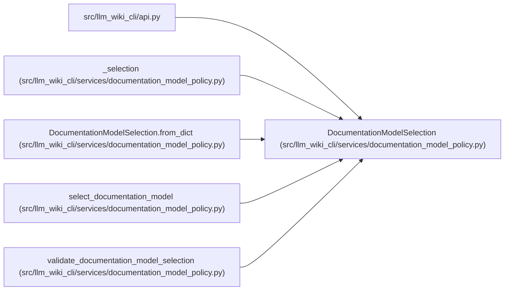

# DocumentationModelSelection

**Location:** `src/llm_wiki_cli/services/documentation_model_policy.py:548`
**Kind:** Class
**Bases:** —
**Module:** [documentation_model_policy](../modules/documentation_model_policy.md)

**Decorators:** `@dataclass(frozen=True)`

## Description

Credential-free model selection produced by a routing decision.

## Attributes

| Name | Type | Default | Description |
|------|------|---------|-------------|
| `mode` | `str` | *required* | — |
| `route_id` | `str` | *required* | — |
| `provider_family` | `str` | *required* | — |
| `provider_id` | `str` | *required* | — |
| `model_id` | `str` | *required* | — |
| `tier` | `str` | *required* | — |
| `basis` | `str` | *required* | — |
| `policy_hash` | `str` | *required* | — |
| `default_route_id` | `str` | *required* | — |
| `matched_rule_id` | `str \| None` | `None` | — |
| `signals` | `tuple[str, ...]` | `()` | — |
| `schema_version` | `str` | `DOCUMENTATION_MODEL_SELECTION_SCHEMA_VERSION` | — |

## Methods

| Method | Signature | Decorators | Description |
|--------|-----------|------------|-------------|
| `__post_init__` | `() -> None` | — | — |
| `to_dict` | `() -> dict[str, Any]` | — | Return fixed-field model metadata that cannot carry credentials. |
| `to_json` | `() -> str` | — | — |
| `from_dict` | `(payload: Mapping[str, Any]) -> 'DocumentationModelSelection'` | `@classmethod` | — |

## Relationships

<!-- Auto-generated relationship summary. Do not edit by hand. -->

### Summary

| Module | Methods | Attributes |
|---|---:|---|
| [documentation_model_policy](../modules/documentation_model_policy.md) | 4 | `basis`, `default_route_id`, `matched_rule_id`, `mode`, `model_id`, `policy_hash`, `provider_family`, `provider_id`, `route_id`, `schema_version`, `signals`, `tier` |

### References

| Reference | Kind | Source | Call sites |
|---|---|---|---:|
| `api` | import | [api](../modules/api.md) | — |
| `_selection` | call | [documentation_model_policy](../modules/documentation_model_policy.md) | 1 |
| `_selection` | type_reference | [documentation_model_policy](../modules/documentation_model_policy.md) | — |
| `DocumentationModelSelection.from_dict` | type_reference | [documentation_model_policy](../modules/documentation_model_policy.md) | — |
| `select_documentation_model` | type_reference | [documentation_model_policy](../modules/documentation_model_policy.md) | — |
| `validate_documentation_model_selection` | type_reference | [documentation_model_policy](../modules/documentation_model_policy.md) | — |
