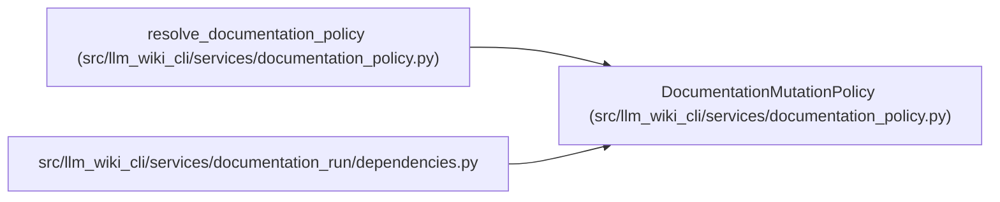

# DocumentationMutationPolicy

**Location:** `src/llm_wiki_cli/services/documentation_policy.py:136`
**Kind:** Class
**Bases:** —
**Module:** [documentation_policy](../modules/documentation_policy.md)

**Decorators:** `@dataclass(frozen=True)`

## Description

Resolved runtime roots and portable policy metadata.

## Attributes

| Name | Type | Default | Description |
|------|------|---------|-------------|
| `workspace_root` | `Path` | *required* | — |
| `source_root` | `Path \| None` | *required* | — |
| `input_wiki_root` | `Path \| None` | *required* | — |
| `helper_cache_root` | `Path \| None` | *required* | — |
| `capture_root` | `Path \| None` | *required* | — |
| `allowed_write_roots` | `tuple[Path, ...]` | *required* | — |
| `forbidden_write_roots` | `tuple[Path, ...]` | *required* | — |
| `source_selection_policy` | `SourceSelectionPolicy \| None` | `None` | — |
| `trust_source_plugins` | `bool` | `False` | — |
| `live_service_url` | `str \| None` | `None` | — |
| `live_service_access_mode` | `str` | `'unspecified'` | — |
| `live_service_observation_allowed` | `bool` | `False` | — |

## Methods

| Method | Signature | Decorators | Description |
|--------|-----------|------------|-------------|
| `assert_write_allowed` | `(target: str \| Path) -> Path` | — | — |
| `to_portable_dict` | `() -> dict[str, Any]` | — | — |

## Relationships

<!-- Auto-generated relationship summary. Do not edit by hand. -->

### Summary

| Module | Methods | Attributes |
|---|---:|---|
| [documentation_policy](../modules/documentation_policy.md) | 2 | `allowed_write_roots`, `capture_root`, `forbidden_write_roots`, `helper_cache_root`, `input_wiki_root`, `live_service_access_mode`, `live_service_observation_allowed`, `live_service_url`, `source_root`, `source_selection_policy`, `trust_source_plugins`, `workspace_root` |

### References

| Reference | Kind | Source | Call sites |
|---|---|---|---:|
| `resolve_documentation_policy` | call | [documentation_policy](../modules/documentation_policy.md) | 1 |
| `resolve_documentation_policy` | type_reference | [documentation_policy](../modules/documentation_policy.md) | — |
| `dependencies` | import | [documentation_run_dependencies](../modules/documentation_run_dependencies.md) | — |
