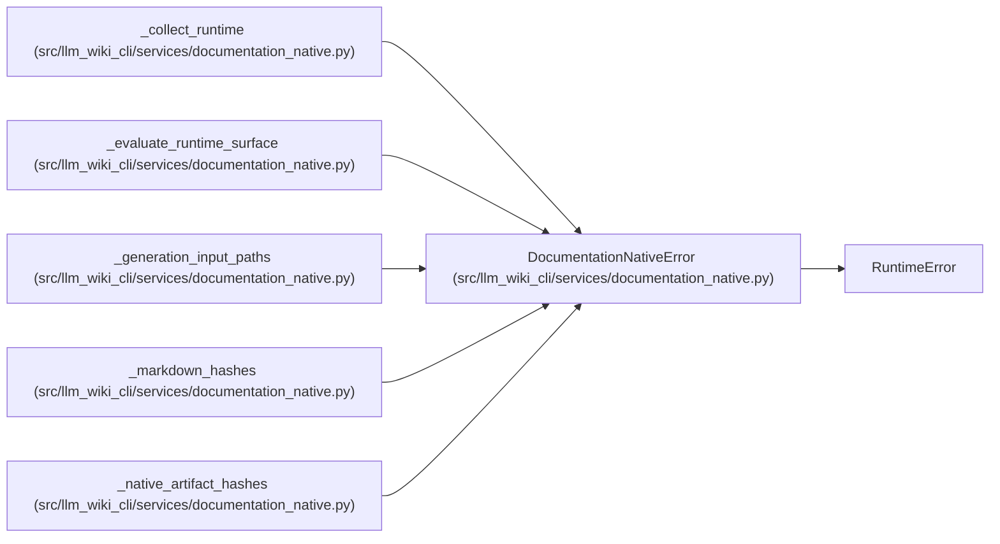

# DocumentationNativeError

**Location:** `src/llm_wiki_cli/services/documentation_native.py:93`
**Kind:** Class
**Bases:** `RuntimeError`
**Module:** [documentation_native](../modules/documentation_native.md)

## Description

Fail-closed native evaluation or refresh error.

## Attributes

*No annotated attributes found.*

## Methods

*No public methods. Inherits from base classes.*

## Relationships

<!-- Auto-generated relationship summary. Do not edit by hand. -->

### Summary

| Module | Methods | Attributes |
|---|---:|---|
| [documentation_native](../modules/documentation_native.md) | 0 | — |

### Structure

| Kind | Entity | Module |
|---|---|---|
| Base | `RuntimeError` | — |

### References

| Reference | Kind | Source |
|---|---|---|
| `_collect_runtime` | call | [documentation_native](../modules/documentation_native.md) |
| `_collect_runtime` | call | [documentation_native](../modules/documentation_native.md) |
| `_collect_runtime` | call | [documentation_native](../modules/documentation_native.md) |
| `_evaluate_runtime_surface` | call | [documentation_native](../modules/documentation_native.md) |
| `_generation_input_paths` | call | [documentation_native](../modules/documentation_native.md) |
| `_generation_input_paths` | call | [documentation_native](../modules/documentation_native.md) |
| `_generation_input_paths` | call | [documentation_native](../modules/documentation_native.md) |
| `_generation_input_paths` | call | [documentation_native](../modules/documentation_native.md) |
| `_markdown_hashes` | call | [documentation_native](../modules/documentation_native.md) |
| `_native_artifact_hashes` | call | [documentation_native](../modules/documentation_native.md) |
| `_native_artifact_hashes` | call | [documentation_native](../modules/documentation_native.md) |
| `_native_artifact_hashes` | call | [documentation_native](../modules/documentation_native.md) |
