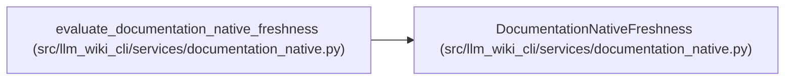

# DocumentationNativeFreshness

**Location:** `src/llm_wiki_cli/services/documentation_native.py:98`
**Kind:** Class
**Bases:** —
**Module:** [documentation_native](../modules/documentation_native.md)

**Decorators:** `@dataclass(frozen=True)`

## Description

Independent v5 compatibility result for standalone adoption.

## Attributes

| Name | Type | Default | Description |
|------|------|---------|-------------|
| `current` | `bool` | *required* | — |
| `reasons` | `tuple[str, ...]` | *required* | — |
| `report` | `KnowledgeFreshnessReport` | *required* | — |
| `source_mismatches` | `tuple[str, ...]` | `()` | — |

## Methods

*No public methods. Inherits from base classes.*

## Relationships

<!-- Auto-generated relationship summary. Do not edit by hand. -->

### Summary

| Module | Methods | Attributes |
|---|---:|---|
| [documentation_native](../modules/documentation_native.md) | 0 | `current`, `reasons`, `report`, `source_mismatches` |

### References

| Reference | Kind | Source | Call sites |
|---|---|---|---:|
| `evaluate_documentation_native_freshness` | call | [documentation_native](../modules/documentation_native.md) | 1 |
| `evaluate_documentation_native_freshness` | type_reference | [documentation_native](../modules/documentation_native.md) | — |
