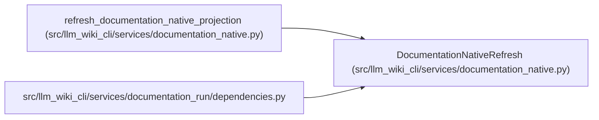

# DocumentationNativeRefresh

**Location:** `src/llm_wiki_cli/services/documentation_native.py:108`
**Kind:** Class
**Bases:** —
**Module:** [documentation_native](../modules/documentation_native.md)

**Decorators:** `@dataclass(frozen=True)`

## Description

One controller-owned native projection refresh.

## Attributes

| Name | Type | Default | Description |
|------|------|---------|-------------|
| `commit` | `KnowledgeCommitResult` | *required* | — |
| `markdown_before` | `Mapping[str, str]` | *required* | — |
| `markdown_after` | `Mapping[str, str]` | *required* | — |
| `artifact_hashes_before` | `Mapping[str, str]` | *required* | — |
| `artifact_hashes_after` | `Mapping[str, str]` | *required* | — |
| `knowledge_view` | `KnowledgeReadView \| None` | `field(default=None, repr=False, compare=False)` | — |

## Methods

| Method | Signature | Decorators | Description |
|--------|-----------|------------|-------------|
| `changed` | `() -> bool` | `@property` | — |
| `artifact_hashes` | `() -> Mapping[str, str]` | `@property` | — |

## Relationships

<!-- Auto-generated relationship summary. Do not edit by hand. -->

### Summary

| Module | Methods | Attributes |
|---|---:|---|
| [documentation_native](../modules/documentation_native.md) | 2 | `artifact_hashes_after`, `artifact_hashes_before`, `commit`, `knowledge_view`, `markdown_after`, `markdown_before` |

### References

| Reference | Kind | Source | Call sites |
|---|---|---|---:|
| `refresh_documentation_native_projection` | call | [documentation_native](../modules/documentation_native.md) | 1 |
| `refresh_documentation_native_projection` | type_reference | [documentation_native](../modules/documentation_native.md) | — |
| `dependencies` | import | [documentation_run_dependencies](../modules/documentation_run_dependencies.md) | — |
