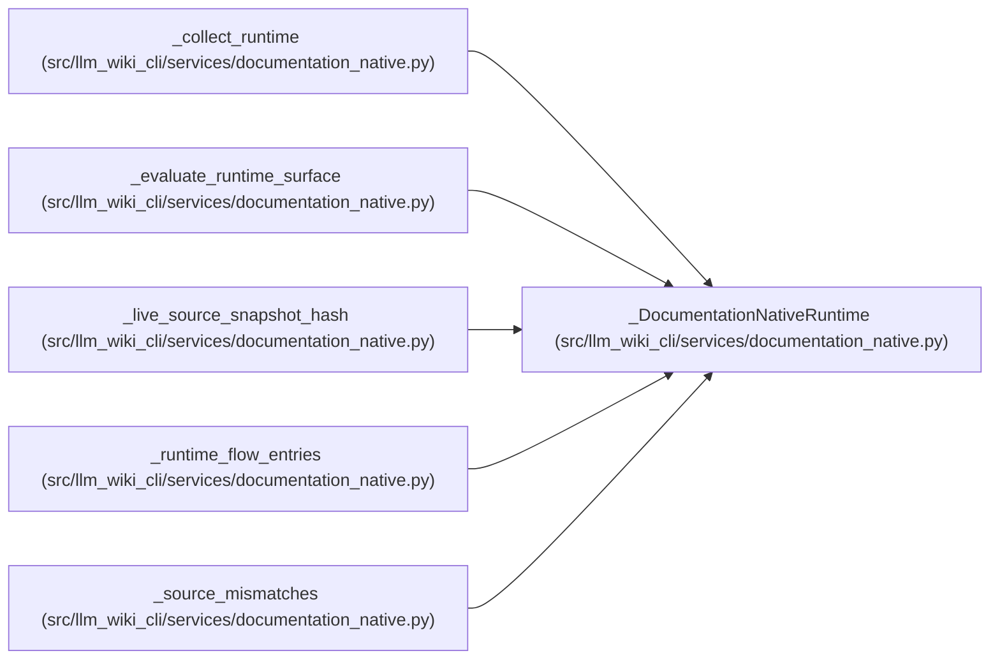

# _DocumentationNativeRuntime

**Location:** `src/llm_wiki_cli/services/documentation_native.py:132`
**Kind:** Class
**Bases:** —
**Module:** [documentation_native](../modules/documentation_native.md)

**Decorators:** `@dataclass(frozen=True)`

## Description

_Auto-generated from `_DocumentationNativeRuntime` in `src/llm_wiki_cli/services/documentation_native.py`._

## Attributes

| Name | Type | Default | Description |
|------|------|---------|-------------|
| `inventory` | `Mapping[str, Mapping[str, Any]]` | *required* | — |
| `infrastructure_inventory` | `Mapping[str, Mapping[str, Any]]` | *required* | — |
| `inventory_result` | `Any` | *required* | — |
| `source_snapshot` | `SourceSnapshot` | *required* | — |
| `uncaptured_generation_inputs` | `tuple[str, ...]` | `()` | — |

## Methods

*No public methods. Inherits from base classes.*

## Relationships

<!-- Auto-generated relationship summary. Do not edit by hand. -->

### Summary

| Module | Methods | Attributes |
|---|---:|---|
| [documentation_native](../modules/documentation_native.md) | 0 | `infrastructure_inventory`, `inventory`, `inventory_result`, `source_snapshot`, `uncaptured_generation_inputs` |

### References

| Reference | Kind | Source | Call sites |
|---|---|---|---:|
| `_collect_runtime` | call | [documentation_native](../modules/documentation_native.md) | 1 |
| `_collect_runtime` | type_reference | [documentation_native](../modules/documentation_native.md) | — |
| `_evaluate_runtime_surface` | type_reference | [documentation_native](../modules/documentation_native.md) | — |
| `_live_source_snapshot_hash` | type_reference | [documentation_native](../modules/documentation_native.md) | — |
| `_runtime_flow_entries` | type_reference | [documentation_native](../modules/documentation_native.md) | — |
| `_source_mismatches` | type_reference | [documentation_native](../modules/documentation_native.md) | — |
