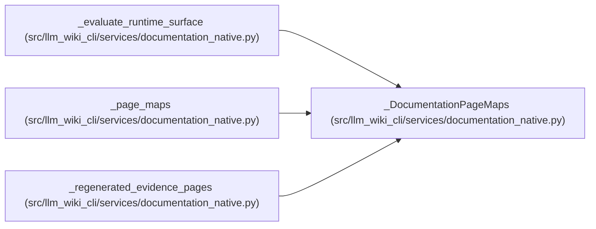

# _DocumentationPageMaps

**Location:** `src/llm_wiki_cli/services/documentation_native.py:141`
**Kind:** Class
**Bases:** —
**Module:** [documentation_native](../modules/documentation_native.md)

**Decorators:** `@dataclass(frozen=True)`

## Description

_Auto-generated from `_DocumentationPageMaps` in `src/llm_wiki_cli/services/documentation_native.py`._

## Attributes

| Name | Type | Default | Description |
|------|------|---------|-------------|
| `module` | `Mapping[str, str]` | *required* | — |
| `entity` | `Mapping[tuple[str, str], str]` | *required* | — |
| `occurrence` | `Mapping[tuple[str, str, int], str]` | *required* | — |

## Methods

*No public methods. Inherits from base classes.*

## Relationships

<!-- Auto-generated relationship summary. Do not edit by hand. -->

### Summary

| Module | Methods | Attributes |
|---|---:|---|
| [documentation_native](../modules/documentation_native.md) | 0 | `entity`, `module`, `occurrence` |

### References

| Reference | Kind | Source | Call sites |
|---|---|---|---:|
| `_evaluate_runtime_surface` | type_reference | [documentation_native](../modules/documentation_native.md) | — |
| `_page_maps` | call | [documentation_native](../modules/documentation_native.md) | 1 |
| `_page_maps` | type_reference | [documentation_native](../modules/documentation_native.md) | — |
| `_regenerated_evidence_pages` | type_reference | [documentation_native](../modules/documentation_native.md) | — |
