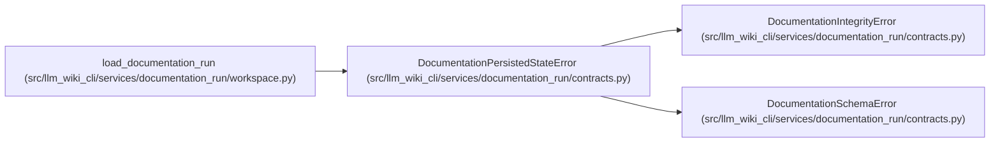

# DocumentationPersistedStateError

**Location:** `src/llm_wiki_cli/services/documentation_run/contracts.py:251`
**Kind:** Class
**Bases:** `DocumentationIntegrityError`, `DocumentationSchemaError`
**Module:** [documentation_run_contracts](../modules/documentation_run_contracts.md)

## Description

Raised when a stored documentation-run contract is corrupt.

## Attributes

*No annotated attributes found.*

## Methods

*No public methods. Inherits from base classes.*

## Relationships

<!-- Auto-generated relationship summary. Do not edit by hand. -->

### Summary

| Module | Methods | Attributes |
|---|---:|---|
| [documentation_run_contracts](../modules/documentation_run_contracts.md) | 0 | — |

### Structure

| Kind | Entity | Module |
|---|---|---|
| Base | `DocumentationIntegrityError` | [documentation_run_contracts](../modules/documentation_run_contracts.md) |
| Base | `DocumentationSchemaError` | [documentation_run_contracts](../modules/documentation_run_contracts.md) |

### References

| Reference | Kind | Source | Call sites |
|---|---|---|---:|
| `load_documentation_run` | call | [workspace](../modules/workspace.md) | 3 |
