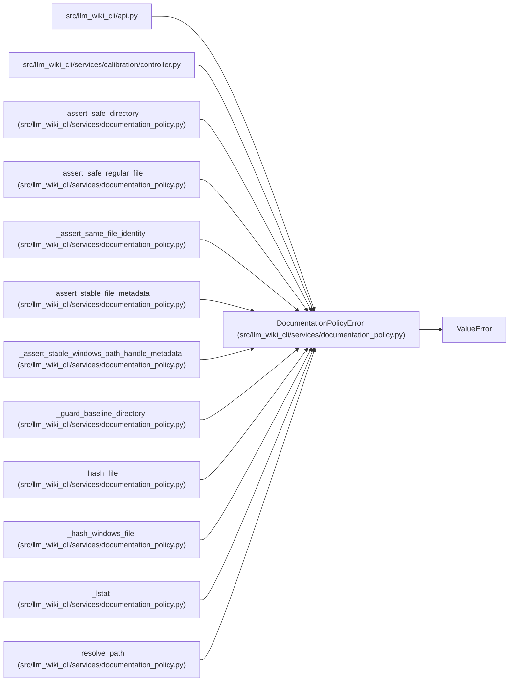

# DocumentationPolicyError

**Location:** `src/llm_wiki_cli/services/documentation_policy.py:71`
**Kind:** Class
**Bases:** `ValueError`
**Module:** [documentation_policy](../modules/documentation_policy.md)

## Description

Raised when an external documentation policy cannot be enforced.

## Attributes

*No annotated attributes found.*

## Methods

*No public methods. Inherits from base classes.*

## Relationships

<!-- Auto-generated relationship summary. Do not edit by hand. -->

### Summary

| Module | Methods | Attributes |
|---|---:|---|
| [documentation_policy](../modules/documentation_policy.md) | 0 | — |

### Structure

| Kind | Entity | Module |
|---|---|---|
| Base | `ValueError` | — |

### References

| Reference | Kind | Source | Call sites |
|---|---|---|---:|
| `api` | import | [api](../modules/api.md) | — |
| `controller` | import | [controller](../modules/controller.md) | — |
| `_assert_safe_directory` | call | [documentation_policy](../modules/documentation_policy.md) | 3 |
| `_assert_safe_regular_file` | call | [documentation_policy](../modules/documentation_policy.md) | 3 |
| `_assert_same_file_identity` | call | [documentation_policy](../modules/documentation_policy.md) | 3 |
| `_assert_stable_file_metadata` | call | [documentation_policy](../modules/documentation_policy.md) | 1 |
| `_assert_stable_windows_path_handle_metadata` | call | [documentation_policy](../modules/documentation_policy.md) | 1 |
| `_guard_baseline_directory` | call | [documentation_policy](../modules/documentation_policy.md) | 1 |
| `_hash_file` | call | [documentation_policy](../modules/documentation_policy.md) | 3 |
| `_hash_windows_file` | call | [documentation_policy](../modules/documentation_policy.md) | 3 |
| `_lstat` | call | [documentation_policy](../modules/documentation_policy.md) | 1 |
| `_resolve_path` | call | [documentation_policy](../modules/documentation_policy.md) | 1 |

> References: showing 12 of 21 logical references; 9 omitted by the 12-row generated summary limit.
