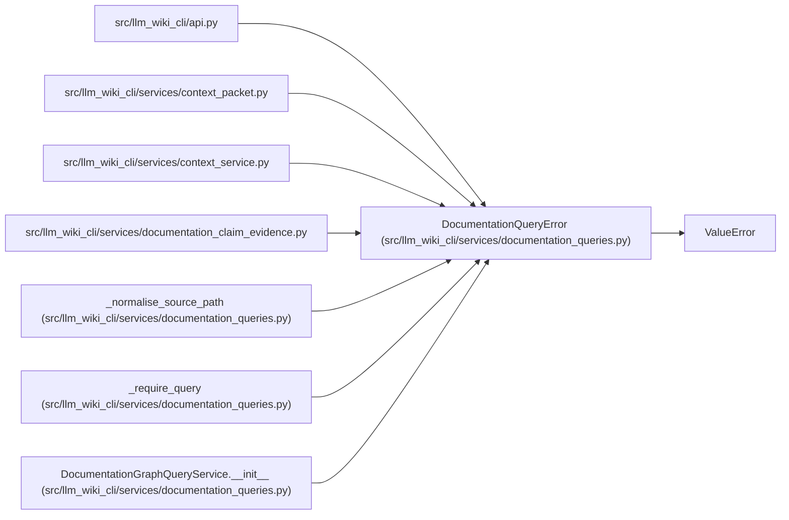

# DocumentationQueryError

**Location:** `src/llm_wiki_cli/services/documentation_queries.py:66`
**Kind:** Class
**Bases:** `ValueError`
**Module:** [documentation_queries](../modules/documentation_queries.md)

## Description

Raised when a documentation graph query request is invalid.

## Attributes

*No annotated attributes found.*

## Methods

*No public methods. Inherits from base classes.*

## Relationships

<!-- Auto-generated relationship summary. Do not edit by hand. -->

### Summary

| Module | Methods | Attributes |
|---|---:|---|
| [documentation_queries](../modules/documentation_queries.md) | 0 | — |

### Structure

| Kind | Entity | Module |
|---|---|---|
| Base | `ValueError` | — |

### References

| Reference | Kind | Source |
|---|---|---|
| `api` | import | [api](../modules/api.md) |
| `context_packet` | import | [context_packet](../modules/context_packet.md) |
| `context_service` | import | [context_service](../modules/context_service.md) |
| `documentation_claim_evidence` | import | [documentation_claim_evidence](../modules/documentation_claim_evidence.md) |
| `_normalise_source_path` | call | [documentation_queries](../modules/documentation_queries.md) |
| `_normalise_source_path` | call | [documentation_queries](../modules/documentation_queries.md) |
| `_normalise_source_path` | call | [documentation_queries](../modules/documentation_queries.md) |
| `_normalise_source_path` | call | [documentation_queries](../modules/documentation_queries.md) |
| `_normalise_source_path` | call | [documentation_queries](../modules/documentation_queries.md) |
| `_require_query` | call | [documentation_queries](../modules/documentation_queries.md) |
| `DocumentationGraphQueryService.__init__` | call | [documentation_queries](../modules/documentation_queries.md) |
| `DocumentationGraphQueryService.__init__` | call | [documentation_queries](../modules/documentation_queries.md) |
