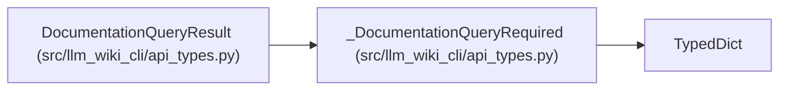

# _DocumentationQueryRequired

**Location:** `src/llm_wiki_cli/api_types.py:257`
**Kind:** Class
**Bases:** `TypedDict`
**Module:** [api_types](../modules/api_types.md)

## Description

_Auto-generated from `_DocumentationQueryRequired` in `src/llm_wiki_cli/api_types.py`._

## Attributes

| Name | Type | Default | Description |
|------|------|---------|-------------|
| `schema_version` | `str` | *required* | — |
| `operation` | `str` | *required* | — |
| `query` | `Any` | *required* | — |
| `found` | `bool` | *required* | — |
| `ambiguous` | `bool` | *required* | — |
| `matches` | `list[dict[str, Any]]` | *required* | — |
| `bounds` | `dict[str, ResultBounds \| ByteResultBounds]` | *required* | — |
| `truncated` | `bool` | *required* | — |
| `cost` | `QueryCostDisclosure` | *required* | — |

## Methods

*No public methods. Inherits from base classes.*

## Relationships

<!-- Auto-generated relationship summary. Do not edit by hand. -->

### Summary

| Module | Methods | Attributes |
|---|---:|---|
| [api_types](../modules/api_types.md) | 0 | `ambiguous`, `bounds`, `cost`, `found`, `matches`, `operation`, `query`, `schema_version`, `truncated` |

### Structure

| Kind | Entity | Module |
|---|---|---|
| Base | `TypedDict` | — |
| Subclass | `DocumentationQueryResult` | [api_types](../modules/api_types.md) |
