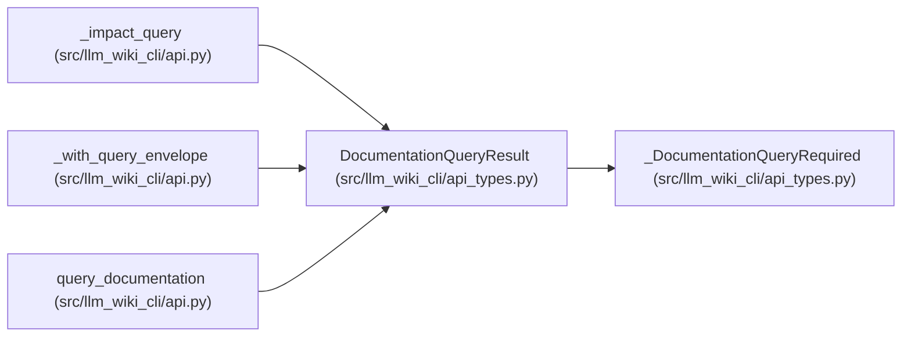

# DocumentationQueryResult

**Location:** `src/llm_wiki_cli/api_types.py:269`
**Kind:** Class
**Bases:** `_DocumentationQueryRequired`
**Module:** [api_types](../modules/api_types.md)

## Description

Common envelope returned by the shared bounded query dispatcher.

## Attributes

| Name | Type | Default | Description |
|------|------|---------|-------------|
| `knowledge` | `KnowledgeStatus \| dict[str, Any]` | *required* | — |
| `concept` | `dict[str, Any] \| None` | *required* | — |
| `total` | `int` | *required* | — |
| `returned` | `int` | *required* | — |
| `direction` | `str` | *required* | — |
| `kinds` | `list[str]` | *required* | — |
| `relationships` | `list[dict[str, Any]]` | *required* | — |
| `related_concepts` | `list[dict[str, Any]]` | *required* | — |
| `unresolved_targets` | `list[dict[str, Any]]` | *required* | — |
| `external_targets` | `list[dict[str, Any]]` | *required* | — |
| `origins` | `list[str]` | *required* | — |
| `resolutions` | `list[str]` | *required* | — |
| `include_evidence` | `bool` | *required* | — |
| `typed_graph` | `dict[str, Any]` | *required* | — |
| `edges` | `list[dict[str, Any]]` | *required* | — |
| `symbol` | `dict[str, Any] \| None` | *required* | — |
| `pages` | `list[dict[str, Any]]` | *required* | — |
| `callers` | `list[dict[str, Any]]` | *required* | — |
| `callees` | `list[dict[str, Any]]` | *required* | — |
| `flow` | `dict[str, Any] \| None` | *required* | — |
| `data_flow` | `dict[str, Any] \| None` | *required* | — |
| `path` | `str \| None` | *required* | — |
| `inbound` | `list[str]` | *required* | — |
| `outbound` | `list[str]` | *required* | — |
| `metrics` | `dict[str, Any]` | *required* | — |
| `cycle_groups` | `list[dict[str, Any]]` | *required* | — |
| `load_order_index` | `int \| None` | *required* | — |
| `impacted_paths` | `list[str]` | *required* | — |
| `concepts` | `list[dict[str, Any]]` | *required* | — |
| `limitations` | `list[str]` | *required* | — |
| `raw_evidence` | `list[dict[str, Any]]` | *required* | — |

## Methods

*No public methods. Inherits from base classes.*

## Relationships

<!-- Auto-generated relationship summary. Do not edit by hand. -->

### Summary

| Module | Methods | Attributes |
|---|---:|---|
| [api_types](../modules/api_types.md) | 0 | `callees`, `callers`, `concept`, `concepts`, `cycle_groups`, `data_flow`, `direction`, `edges`, `external_targets`, `flow`, `impacted_paths`, `inbound` |

### Structure

| Kind | Entity | Module |
|---|---|---|
| Base | `_DocumentationQueryRequired` | [api_types](../modules/api_types.md) |

### References

| Reference | Kind | Source | Call sites |
|---|---|---|---:|
| `_impact_query` | type_reference | [api](../modules/api.md) | — |
| `_with_query_envelope` | type_reference | [api](../modules/api.md) | — |
| `query_documentation` | type_reference | [api](../modules/api.md) | — |
