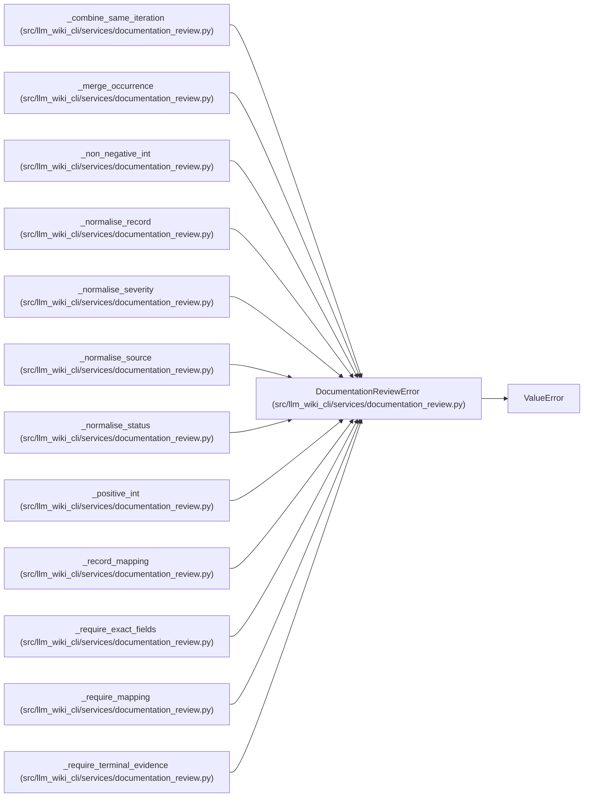

# DocumentationReviewError

**Location:** `src/llm_wiki_cli/services/documentation_review.py:170`
**Kind:** Class
**Bases:** `ValueError`
**Module:** [documentation_review](../modules/documentation_review.md)

## Description

Raised when review evidence cannot satisfy the ledger contract.

## Attributes

*No annotated attributes found.*

## Methods

*No public methods. Inherits from base classes.*

## Relationships

<!-- Auto-generated relationship summary. Do not edit by hand. -->

### Summary

| Module | Methods | Attributes |
|---|---:|---|
| [documentation_review](../modules/documentation_review.md) | 0 | — |

### Structure

| Kind | Entity | Module |
|---|---|---|
| Base | `ValueError` | — |

### References

| Reference | Kind | Source | Call sites |
|---|---|---|---:|
| `_combine_same_iteration` | call | [documentation_review](../modules/documentation_review.md) | 1 |
| `_merge_occurrence` | call | [documentation_review](../modules/documentation_review.md) | 1 |
| `_non_negative_int` | call | [documentation_review](../modules/documentation_review.md) | 1 |
| `_normalise_record` | call | [documentation_review](../modules/documentation_review.md) | 1 |
| `_normalise_severity` | call | [documentation_review](../modules/documentation_review.md) | 1 |
| `_normalise_source` | call | [documentation_review](../modules/documentation_review.md) | 1 |
| `_normalise_status` | call | [documentation_review](../modules/documentation_review.md) | 1 |
| `_positive_int` | call | [documentation_review](../modules/documentation_review.md) | 1 |
| `_record_mapping` | call | [documentation_review](../modules/documentation_review.md) | 1 |
| `_require_exact_fields` | call | [documentation_review](../modules/documentation_review.md) | 3 |
| `_require_mapping` | call | [documentation_review](../modules/documentation_review.md) | 1 |
| `_require_terminal_evidence` | call | [documentation_review](../modules/documentation_review.md) | 1 |

> References: showing 12 of 30 logical references; 18 omitted by the 12-row generated summary limit.
