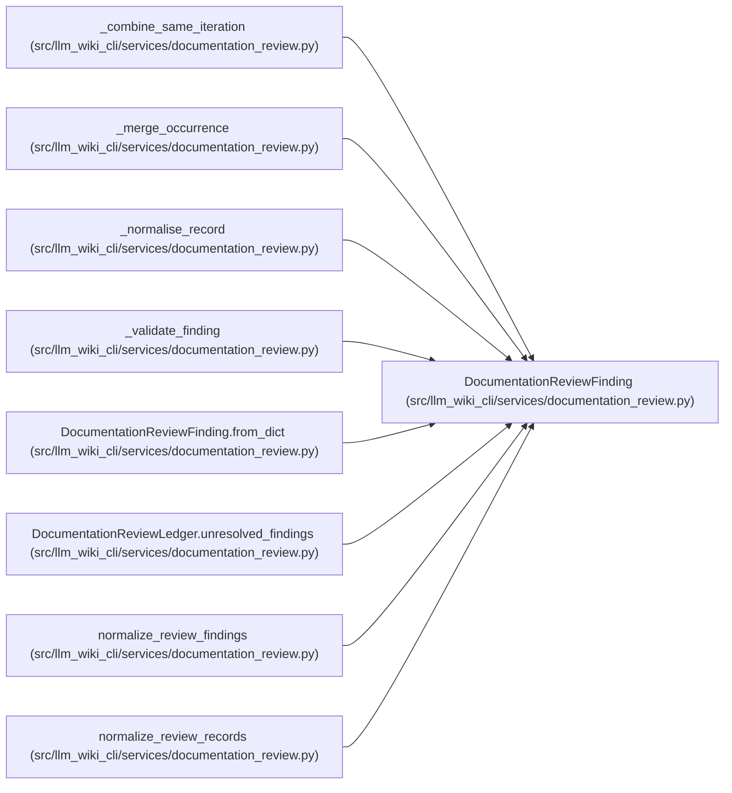

# DocumentationReviewFinding

**Location:** `src/llm_wiki_cli/services/documentation_review.py:175`
**Kind:** Class
**Bases:** —
**Module:** [documentation_review](../modules/documentation_review.md)

**Decorators:** `@dataclass(frozen=True)`

## Description

One stable finding accumulated across review iterations.

## Attributes

| Name | Type | Default | Description |
|------|------|---------|-------------|
| `finding_id` | `str` | *required* | — |
| `category` | `str` | *required* | — |
| `severity` | `str` | *required* | — |
| `source` | `str` | *required* | — |
| `status` | `str` | *required* | — |
| `evidence` | `tuple[str, ...]` | *required* | — |
| `rationale` | `str` | *required* | — |
| `first_seen` | `str` | *required* | — |
| `last_seen` | `str` | *required* | — |
| `occurrence_count` | `int` | *required* | — |
| `paths` | `tuple[str, ...]` | `()` | — |
| `targets` | `tuple[str, ...]` | `()` | — |
| `external_ids` | `tuple[str, ...]` | `()` | — |

## Methods

| Method | Signature | Decorators | Description |
|--------|-----------|------------|-------------|
| `terminal` | `() -> bool` | `@property` | — |
| `unresolved` | `() -> bool` | `@property` | — |
| `to_dict` | `() -> dict[str, Any]` | — | Return a deterministic JSON-compatible finding. |
| `from_dict` | `(payload: Mapping[str, Any]) -> 'DocumentationReviewFinding'` | `@classmethod` | — |

## Relationships

<!-- Auto-generated relationship summary. Do not edit by hand. -->

### Summary

| Module | Methods | Attributes |
|---|---:|---|
| [documentation_review](../modules/documentation_review.md) | 4 | `category`, `evidence`, `external_ids`, `finding_id`, `first_seen`, `last_seen`, `occurrence_count`, `paths`, `rationale`, `severity`, `source`, `status` |

### References

| Reference | Kind | Source | Call sites |
|---|---|---|---:|
| `_combine_same_iteration` | type_reference | [documentation_review](../modules/documentation_review.md) | — |
| `_merge_occurrence` | type_reference | [documentation_review](../modules/documentation_review.md) | — |
| `_normalise_record` | call | [documentation_review](../modules/documentation_review.md) | 1 |
| `_normalise_record` | type_reference | [documentation_review](../modules/documentation_review.md) | — |
| `_validate_finding` | type_reference | [documentation_review](../modules/documentation_review.md) | — |
| `DocumentationReviewFinding.from_dict` | type_reference | [documentation_review](../modules/documentation_review.md) | — |
| `DocumentationReviewLedger.unresolved_findings` | type_reference | [documentation_review](../modules/documentation_review.md) | — |
| `normalize_review_findings` | type_reference | [documentation_review](../modules/documentation_review.md) | — |
| `normalize_review_records` | type_reference | [documentation_review](../modules/documentation_review.md) | — |
