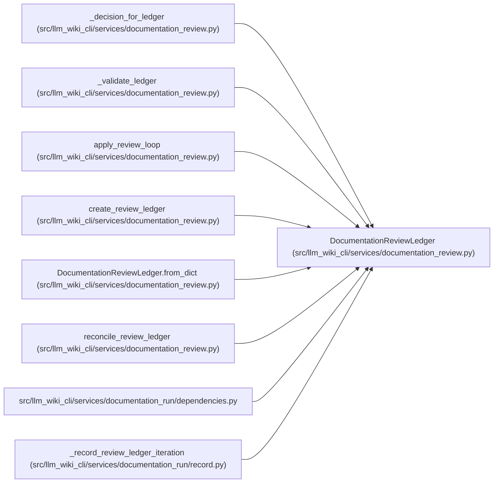

# DocumentationReviewLedger

**Location:** `src/llm_wiki_cli/services/documentation_review.py:359`
**Kind:** Class
**Bases:** —
**Module:** [documentation_review](../modules/documentation_review.md)

**Decorators:** `@dataclass(frozen=True)`

## Description

Versioned, JSON-friendly state for the bounded review loop.

## Attributes

| Name | Type | Default | Description |
|------|------|---------|-------------|
| `run_id` | `str` | *required* | — |
| `max_loops` | `int` | *required* | — |
| `loop_count` | `int` | `0` | — |
| `state` | `str` | `'pending'` | — |
| `findings` | `tuple[DocumentationReviewFinding, ...]` | `()` | — |
| `worker_packets` | `tuple[DocumentationReviewPacket, ...]` | `()` | — |
| `reviewer_packets` | `tuple[DocumentationReviewPacket, ...]` | `()` | — |
| `supervisor_reconciliations` | `tuple[SupervisorReconciliation, ...]` | `()` | — |
| `schema_version` | `str` | `DOCUMENTATION_REVIEW_LEDGER_SCHEMA_VERSION` | — |

## Methods

| Method | Signature | Decorators | Description |
|--------|-----------|------------|-------------|
| `publish_ready` | `() -> bool` | `@property` | — |
| `unresolved_findings` | `() -> tuple[DocumentationReviewFinding, ...]` | `@property` | — |
| `to_dict` | `() -> dict[str, Any]` | — | — |
| `to_json` | `() -> str` | — | — |
| `from_dict` | `(payload: Mapping[str, Any]) -> 'DocumentationReviewLedger'` | `@classmethod` | — |

## Relationships

<!-- Auto-generated relationship summary. Do not edit by hand. -->

### Summary

| Module | Methods | Attributes |
|---|---:|---|
| [documentation_review](../modules/documentation_review.md) | 5 | `findings`, `loop_count`, `max_loops`, `reviewer_packets`, `run_id`, `schema_version`, `state`, `supervisor_reconciliations`, `worker_packets` |

### References

| Reference | Kind | Source | Call sites |
|---|---|---|---:|
| `_decision_for_ledger` | type_reference | [documentation_review](../modules/documentation_review.md) | — |
| `_validate_ledger` | type_reference | [documentation_review](../modules/documentation_review.md) | — |
| `apply_review_loop` | type_reference | [documentation_review](../modules/documentation_review.md) | — |
| `create_review_ledger` | call | [documentation_review](../modules/documentation_review.md) | 1 |
| `create_review_ledger` | type_reference | [documentation_review](../modules/documentation_review.md) | — |
| `DocumentationReviewLedger.from_dict` | type_reference | [documentation_review](../modules/documentation_review.md) | — |
| `reconcile_review_ledger` | type_reference | [documentation_review](../modules/documentation_review.md) | — |
| `dependencies` | import | [documentation_run_dependencies](../modules/documentation_run_dependencies.md) | — |
| `_record_review_ledger_iteration` | call | [record](../modules/record.md) | 1 |
