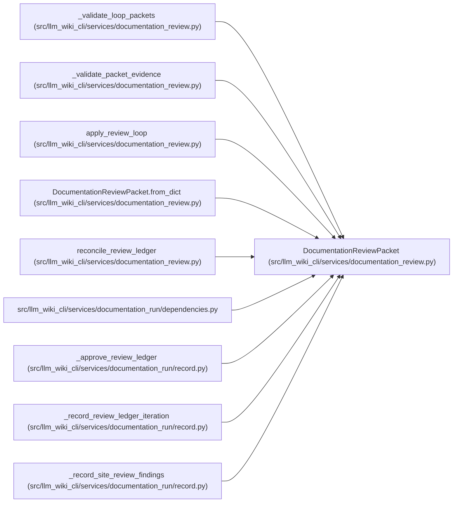

# DocumentationReviewPacket

**Location:** `src/llm_wiki_cli/services/documentation_review.py:256`
**Kind:** Class
**Bases:** —
**Module:** [documentation_review](../modules/documentation_review.md)

**Decorators:** `@dataclass(frozen=True)`

## Description

Auditable reference to one role-specific packet and result.

## Attributes

| Name | Type | Default | Description |
|------|------|---------|-------------|
| `packet_id` | `str` | *required* | — |
| `role` | `str` | *required* | — |
| `actor_id` | `str` | *required* | — |
| `iteration` | `int` | *required* | — |
| `packet_hash` | `str` | *required* | — |
| `result_hash` | `str` | *required* | — |
| `recorded_at` | `str` | *required* | — |
| `evidence` | `tuple[str, ...]` | `()` | — |

## Methods

| Method | Signature | Decorators | Description |
|--------|-----------|------------|-------------|
| `__post_init__` | `() -> None` | — | — |
| `to_dict` | `() -> dict[str, Any]` | — | — |
| `from_dict` | `(payload: Mapping[str, Any]) -> 'DocumentationReviewPacket'` | `@classmethod` | — |

## Relationships

<!-- Auto-generated relationship summary. Do not edit by hand. -->

### Summary

| Module | Methods | Attributes |
|---|---:|---|
| [documentation_review](../modules/documentation_review.md) | 3 | `actor_id`, `evidence`, `iteration`, `packet_hash`, `packet_id`, `recorded_at`, `result_hash`, `role` |

### References

| Reference | Kind | Source | Call sites |
|---|---|---|---:|
| `_validate_loop_packets` | type_reference | [documentation_review](../modules/documentation_review.md) | — |
| `_validate_packet_evidence` | type_reference | [documentation_review](../modules/documentation_review.md) | — |
| `apply_review_loop` | type_reference | [documentation_review](../modules/documentation_review.md) | — |
| `DocumentationReviewPacket.from_dict` | type_reference | [documentation_review](../modules/documentation_review.md) | — |
| `reconcile_review_ledger` | type_reference | [documentation_review](../modules/documentation_review.md) | — |
| `dependencies` | import | [documentation_run_dependencies](../modules/documentation_run_dependencies.md) | — |
| `_approve_review_ledger` | call | [record](../modules/record.md) | 1 |
| `_record_review_ledger_iteration` | call | [record](../modules/record.md) | 2 |
| `_record_site_review_findings` | call | [record](../modules/record.md) | 2 |
