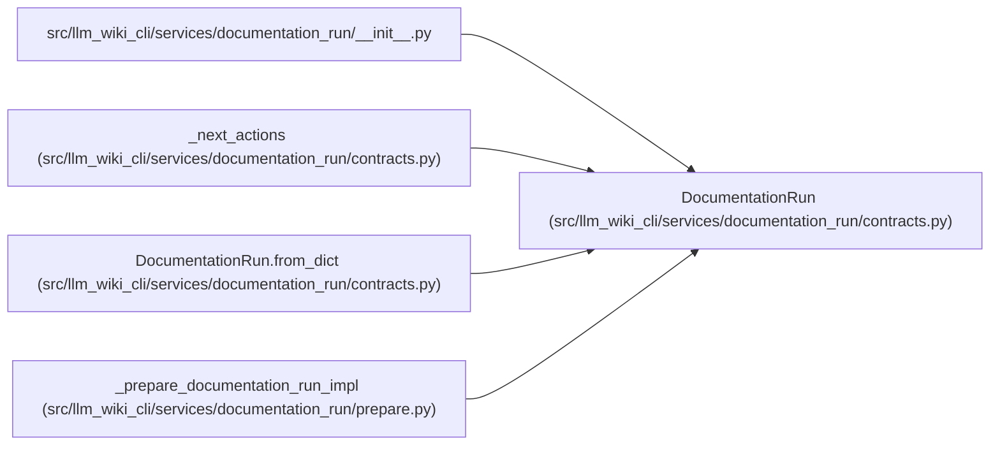

# DocumentationRun

**Location:** `src/llm_wiki_cli/services/documentation_run/contracts.py:565`
**Kind:** Class
**Bases:** —
**Module:** [documentation_run_contracts](../modules/documentation_run_contracts.md)

**Decorators:** `@dataclass`

## Description

_Auto-generated from `DocumentationRun` in `src/llm_wiki_cli/services/documentation_run/contracts.py`._

## Attributes

| Name | Type | Default | Description |
|------|------|---------|-------------|
| `run_id` | `str` | *required* | — |
| `state` | `str` | *required* | — |
| `baseline_strategy` | `str` | *required* | — |
| `created_at` | `str` | *required* | — |
| `updated_at` | `str` | *required* | — |
| `intake` | `DocumentationIntakeBrief` | *required* | — |
| `source` | `dict[str, Any]` | *required* | — |
| `baseline` | `dict[str, Any]` | *required* | — |
| `paths` | `dict[str, str]` | *required* | — |
| `policy` | `dict[str, Any]` | *required* | — |
| `publication` | `dict[str, Any]` | *required* | — |
| `skills` | `list[dict[str, Any]]` | *required* | — |
| `semantic_budget` | `int` | *required* | — |
| `adjustment_loop_limit` | `int` | *required* | — |
| `integrity_anchors` | `dict[str, str]` | `field(default_factory=dict)` | — |
| `evidence` | `dict[str, str]` | `field(default_factory=dict)` | — |
| `work` | `dict[str, list[str]]` | `field(default_factory=lambda: {'reused': [], 'completed': [], 'deferred': [], 'blocked': []})` | — |
| `validation_results` | `list[dict[str, Any]]` | `field(default_factory=list)` | — |
| `unresolved_findings` | `list[dict[str, Any]]` | `field(default_factory=list)` | — |
| `stage_attempts` | `dict[str, int]` | `field(default_factory=dict)` | — |
| `current_stage` | `str \| None` | `None` | — |
| `resume_state` | `str \| None` | `None` | — |
| `verdict_limitations` | `list[str]` | `field(default_factory=list)` | — |
| `schema_version` | `str` | `DOCUMENTATION_RUN_SCHEMA_VERSION` | — |
| `integration_mode` | `str` | `'external_agent_docs'` | — |
| `extensions` | `dict[str, Any]` | `field(default_factory=dict)` | — |

## Methods

| Method | Signature | Decorators | Description |
|--------|-----------|------------|-------------|
| `to_dict` | `() -> dict[str, Any]` | — | — |
| `from_dict` | `(payload: Mapping[str, Any]) -> 'DocumentationRun'` | `@classmethod` | — |

## Relationships

<!-- Auto-generated relationship summary. Do not edit by hand. -->

### Summary

| Module | Methods | Attributes |
|---|---:|---|
| [documentation_run_contracts](../modules/documentation_run_contracts.md) | 2 | `adjustment_loop_limit`, `baseline`, `baseline_strategy`, `created_at`, `current_stage`, `evidence`, `extensions`, `intake`, `integration_mode`, `integrity_anchors`, `paths`, `policy` |

### References

| Reference | Kind | Source | Call sites |
|---|---|---|---:|
| `__init__` | import | [documentation_run___init__](../modules/documentation_run___init__.md) | — |
| `_next_actions` | type_reference | [documentation_run_contracts](../modules/documentation_run_contracts.md) | — |
| `DocumentationRun.from_dict` | type_reference | [documentation_run_contracts](../modules/documentation_run_contracts.md) | — |
| `_prepare_documentation_run_impl` | call | [prepare](../modules/prepare.md) | 1 |
