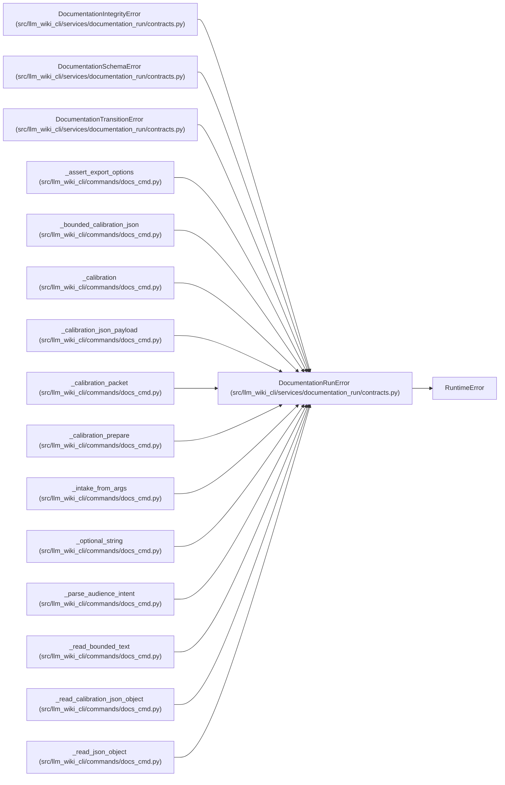

# DocumentationRunError

**Location:** `src/llm_wiki_cli/services/documentation_run/contracts.py:235`
**Kind:** Class
**Bases:** `RuntimeError`
**Module:** [documentation_run_contracts](../modules/documentation_run_contracts.md)

## Description

Base error raised by the documentation lifecycle service.

## Attributes

*No annotated attributes found.*

## Methods

*No public methods. Inherits from base classes.*

## Relationships

<!-- Auto-generated relationship summary. Do not edit by hand. -->

### Summary

| Module | Methods | Attributes |
|---|---:|---|
| [documentation_run_contracts](../modules/documentation_run_contracts.md) | 0 | — |

### Structure

| Kind | Entity | Module |
|---|---|---|
| Base | `RuntimeError` | — |
| Subclass | `DocumentationIntegrityError` | [documentation_run_contracts](../modules/documentation_run_contracts.md) |
| Subclass | `DocumentationSchemaError` | [documentation_run_contracts](../modules/documentation_run_contracts.md) |
| Subclass | `DocumentationTransitionError` | [documentation_run_contracts](../modules/documentation_run_contracts.md) |

### References

| Reference | Kind | Source | Call sites |
|---|---|---|---:|
| `_assert_export_options` | call | [docs_cmd](../modules/docs_cmd.md) | 6 |
| `_bounded_calibration_json` | call | [docs_cmd](../modules/docs_cmd.md) | 2 |
| `_calibration` | call | [docs_cmd](../modules/docs_cmd.md) | 2 |
| `_calibration_json_payload` | call | [docs_cmd](../modules/docs_cmd.md) | 2 |
| `_calibration_packet` | call | [docs_cmd](../modules/docs_cmd.md) | 2 |
| `_calibration_prepare` | call | [docs_cmd](../modules/docs_cmd.md) | 1 |
| `_intake_from_args` | call | [docs_cmd](../modules/docs_cmd.md) | 8 |
| `_optional_string` | call | [docs_cmd](../modules/docs_cmd.md) | 1 |
| `_parse_audience_intent` | call | [docs_cmd](../modules/docs_cmd.md) | 1 |
| `_read_bounded_text` | call | [docs_cmd](../modules/docs_cmd.md) | 3 |
| `_read_calibration_json_object` | call | [docs_cmd](../modules/docs_cmd.md) | 6 |
| `_read_json_object` | call | [docs_cmd](../modules/docs_cmd.md) | 3 |

> References: showing 12 of 23 logical references; 11 omitted by the 12-row generated summary limit.
