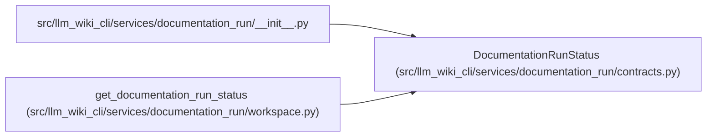

# DocumentationRunStatus

**Location:** `src/llm_wiki_cli/services/documentation_run/contracts.py:714`
**Kind:** Class
**Bases:** —
**Module:** [documentation_run_contracts](../modules/documentation_run_contracts.md)

**Decorators:** `@dataclass(frozen=True)`

## Description

_Auto-generated from `DocumentationRunStatus` in `src/llm_wiki_cli/services/documentation_run/contracts.py`._

## Attributes

| Name | Type | Default | Description |
|------|------|---------|-------------|
| `run_id` | `str` | *required* | — |
| `state` | `str` | *required* | — |
| `baseline_strategy` | `str` | *required* | — |
| `source_available` | `bool` | *required* | — |
| `freshness` | `str` | *required* | — |
| `current_stage` | `str \| None` | *required* | — |
| `next_actions` | `tuple[str, ...]` | *required* | — |
| `limitations` | `tuple[str, ...]` | *required* | — |
| `healthy` | `bool` | *required* | — |

## Methods

| Method | Signature | Decorators | Description |
|--------|-----------|------------|-------------|
| `to_dict` | `() -> dict[str, Any]` | — | — |

## Relationships

<!-- Auto-generated relationship summary. Do not edit by hand. -->

### Summary

| Module | Methods | Attributes |
|---|---:|---|
| [documentation_run_contracts](../modules/documentation_run_contracts.md) | 1 | `baseline_strategy`, `current_stage`, `freshness`, `healthy`, `limitations`, `next_actions`, `run_id`, `source_available`, `state` |

### References

| Reference | Kind | Source |
|---|---|---|
| `__init__` | import | [documentation_run___init__](../modules/documentation_run___init__.md) |
| `get_documentation_run_status` | call | [workspace](../modules/workspace.md) |
