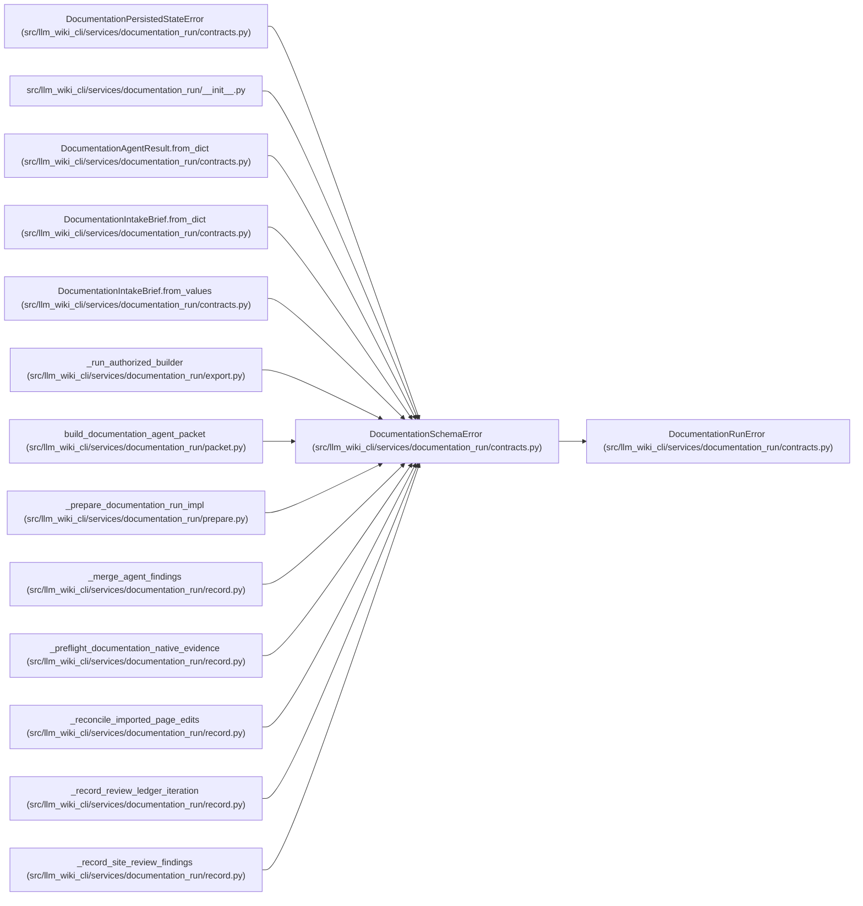

# DocumentationSchemaError

**Location:** `src/llm_wiki_cli/services/documentation_run/contracts.py:239`
**Kind:** Class
**Bases:** `DocumentationRunError`
**Module:** [documentation_run_contracts](../modules/documentation_run_contracts.md)

## Description

Raised when a persisted or returned contract is invalid.

## Attributes

*No annotated attributes found.*

## Methods

*No public methods. Inherits from base classes.*

## Relationships

<!-- Auto-generated relationship summary. Do not edit by hand. -->

### Summary

| Module | Methods | Attributes |
|---|---:|---|
| [documentation_run_contracts](../modules/documentation_run_contracts.md) | 0 | — |

### Structure

| Kind | Entity | Module |
|---|---|---|
| Base | `DocumentationRunError` | [documentation_run_contracts](../modules/documentation_run_contracts.md) |
| Subclass | `DocumentationPersistedStateError` | [documentation_run_contracts](../modules/documentation_run_contracts.md) |

### References

| Reference | Kind | Source | Call sites |
|---|---|---|---:|
| `__init__` | import | [documentation_run___init__](../modules/documentation_run___init__.md) | — |
| `DocumentationAgentResult.from_dict` | call | [documentation_run_contracts](../modules/documentation_run_contracts.md) | 5 |
| `DocumentationIntakeBrief.from_dict` | call | [documentation_run_contracts](../modules/documentation_run_contracts.md) | 19 |
| `DocumentationIntakeBrief.from_values` | call | [documentation_run_contracts](../modules/documentation_run_contracts.md) | 11 |
| `_run_authorized_builder` | call | [export](../modules/export.md) | 1 |
| `build_documentation_agent_packet` | call | [packet](../modules/packet.md) | 1 |
| `_prepare_documentation_run_impl` | call | [prepare](../modules/prepare.md) | 13 |
| `_merge_agent_findings` | call | [record](../modules/record.md) | 2 |
| `_preflight_documentation_native_evidence` | call | [record](../modules/record.md) | 6 |
| `_reconcile_imported_page_edits` | call | [record](../modules/record.md) | 1 |
| `_record_review_ledger_iteration` | call | [record](../modules/record.md) | 5 |
| `_record_site_review_findings` | call | [record](../modules/record.md) | 1 |

> References: showing 12 of 37 logical references; 25 omitted by the 12-row generated summary limit.
