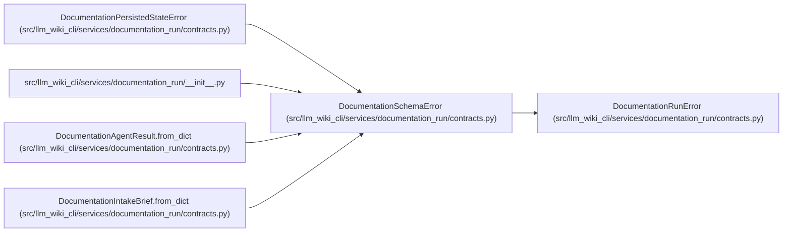

# DocumentationSchemaError

**Location:** `src/llm_wiki_cli/services/documentation_run/contracts.py:239`
**Kind:** Class
**Bases:** `DocumentationRunError`
**Module:** [documentation_run_contracts](../modules/documentation_run_contracts.md)

## Description

Raised when a persisted or returned contract is invalid.

## Attributes

*No annotated attributes found.*

## Methods

*No public methods. Inherits from base classes.*

## Relationships

<!-- Auto-generated relationship summary. Do not edit by hand. -->

### Summary

| Module | Methods | Attributes |
|---|---:|---|
| [documentation_run_contracts](../modules/documentation_run_contracts.md) | 0 | — |

### Structure

| Kind | Entity | Module |
|---|---|---|
| Base | `DocumentationRunError` | [documentation_run_contracts](../modules/documentation_run_contracts.md) |
| Subclass | `DocumentationPersistedStateError` | [documentation_run_contracts](../modules/documentation_run_contracts.md) |

### References

| Reference | Kind | Source |
|---|---|---|
| `__init__` | import | [documentation_run___init__](../modules/documentation_run___init__.md) |
| `DocumentationAgentResult.from_dict` | call | [documentation_run_contracts](../modules/documentation_run_contracts.md) |
| `DocumentationAgentResult.from_dict` | call | [documentation_run_contracts](../modules/documentation_run_contracts.md) |
| `DocumentationAgentResult.from_dict` | call | [documentation_run_contracts](../modules/documentation_run_contracts.md) |
| `DocumentationAgentResult.from_dict` | call | [documentation_run_contracts](../modules/documentation_run_contracts.md) |
| `DocumentationAgentResult.from_dict` | call | [documentation_run_contracts](../modules/documentation_run_contracts.md) |
| `DocumentationIntakeBrief.from_dict` | call | [documentation_run_contracts](../modules/documentation_run_contracts.md) |
| `DocumentationIntakeBrief.from_dict` | call | [documentation_run_contracts](../modules/documentation_run_contracts.md) |
| `DocumentationIntakeBrief.from_dict` | call | [documentation_run_contracts](../modules/documentation_run_contracts.md) |
| `DocumentationIntakeBrief.from_dict` | call | [documentation_run_contracts](../modules/documentation_run_contracts.md) |
| `DocumentationIntakeBrief.from_dict` | call | [documentation_run_contracts](../modules/documentation_run_contracts.md) |
| `DocumentationIntakeBrief.from_dict` | call | [documentation_run_contracts](../modules/documentation_run_contracts.md) |
