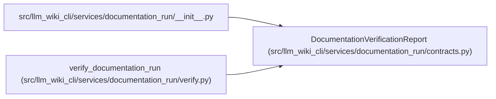

# DocumentationVerificationReport

**Location:** `src/llm_wiki_cli/services/documentation_run/contracts.py:892`
**Kind:** Class
**Bases:** —
**Module:** [documentation_run_contracts](../modules/documentation_run_contracts.md)

**Decorators:** `@dataclass(frozen=True)`

## Description

_Auto-generated from `DocumentationVerificationReport` in `src/llm_wiki_cli/services/documentation_run/contracts.py`._

## Attributes

| Name | Type | Default | Description |
|------|------|---------|-------------|
| `run_id` | `str` | *required* | — |
| `state` | `str` | *required* | — |
| `ok` | `bool` | *required* | — |
| `checks` | `tuple[dict[str, Any], ...]` | *required* | — |
| `limitations` | `tuple[str, ...]` | *required* | — |
| `next_state` | `str \| None` | `None` | — |
| `schema_version` | `str` | `DOCUMENTATION_VERIFICATION_SCHEMA_VERSION` | — |

## Methods

| Method | Signature | Decorators | Description |
|--------|-----------|------------|-------------|
| `to_dict` | `() -> dict[str, Any]` | — | — |

## Relationships

<!-- Auto-generated relationship summary. Do not edit by hand. -->

### Summary

| Module | Methods | Attributes |
|---|---:|---|
| [documentation_run_contracts](../modules/documentation_run_contracts.md) | 1 | `checks`, `limitations`, `next_state`, `ok`, `run_id`, `schema_version`, `state` |

### References

| Reference | Kind | Source | Call sites |
|---|---|---|---:|
| `__init__` | import | [documentation_run___init__](../modules/documentation_run___init__.md) | — |
| `verify_documentation_run` | call | [verify](../modules/verify.md) | 1 |
