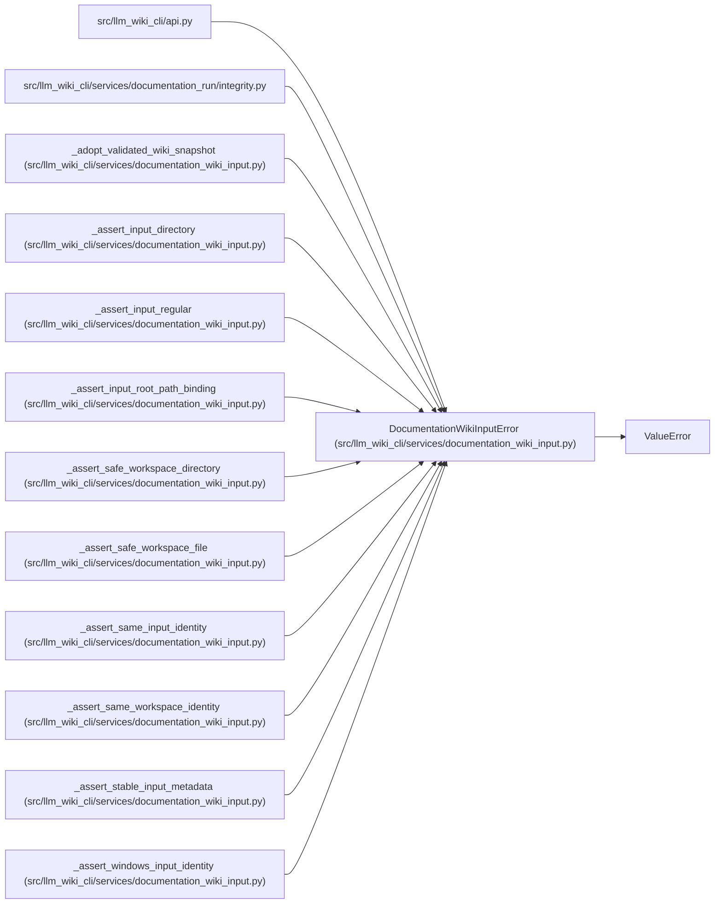

# DocumentationWikiInputError

**Location:** `src/llm_wiki_cli/services/documentation_wiki_input.py:211`
**Kind:** Class
**Bases:** `ValueError`
**Module:** [documentation_wiki_input](../modules/documentation_wiki_input.md)

## Description

Raised when a wiki cannot be adopted without weakening isolation.

## Attributes

*No annotated attributes found.*

## Methods

| Method | Signature | Decorators | Description |
|--------|-----------|------------|-------------|
| `__init__` | `(message: str, *, category: str = 'invalid_wiki_input', path: str \| None = None, rejected_entries: tuple[str, ...] = (), diagnostics: tuple[str, ...] = ()) -> None` | — | — |

## Relationships

<!-- Auto-generated relationship summary. Do not edit by hand. -->

### Summary

| Module | Methods | Attributes |
|---|---:|---|
| [documentation_wiki_input](../modules/documentation_wiki_input.md) | 1 | — |

### Structure

| Kind | Entity | Module |
|---|---|---|
| Base | `ValueError` | — |

### References

| Reference | Kind | Source | Call sites |
|---|---|---|---:|
| `api` | import | [api](../modules/api.md) | — |
| `integrity` | import | [integrity](../modules/integrity.md) | — |
| `_adopt_validated_wiki_snapshot` | call | [documentation_wiki_input](../modules/documentation_wiki_input.md) | 4 |
| `_assert_input_directory` | call | [documentation_wiki_input](../modules/documentation_wiki_input.md) | 1 |
| `_assert_input_regular` | call | [documentation_wiki_input](../modules/documentation_wiki_input.md) | 1 |
| `_assert_input_root_path_binding` | call | [documentation_wiki_input](../modules/documentation_wiki_input.md) | 1 |
| `_assert_safe_workspace_directory` | call | [documentation_wiki_input](../modules/documentation_wiki_input.md) | 2 |
| `_assert_safe_workspace_file` | call | [documentation_wiki_input](../modules/documentation_wiki_input.md) | 1 |
| `_assert_same_input_identity` | call | [documentation_wiki_input](../modules/documentation_wiki_input.md) | 1 |
| `_assert_same_workspace_identity` | call | [documentation_wiki_input](../modules/documentation_wiki_input.md) | 1 |
| `_assert_stable_input_metadata` | call | [documentation_wiki_input](../modules/documentation_wiki_input.md) | 1 |
| `_assert_windows_input_identity` | call | [documentation_wiki_input](../modules/documentation_wiki_input.md) | 2 |

> References: showing 12 of 63 logical references; 51 omitted by the 12-row generated summary limit.
