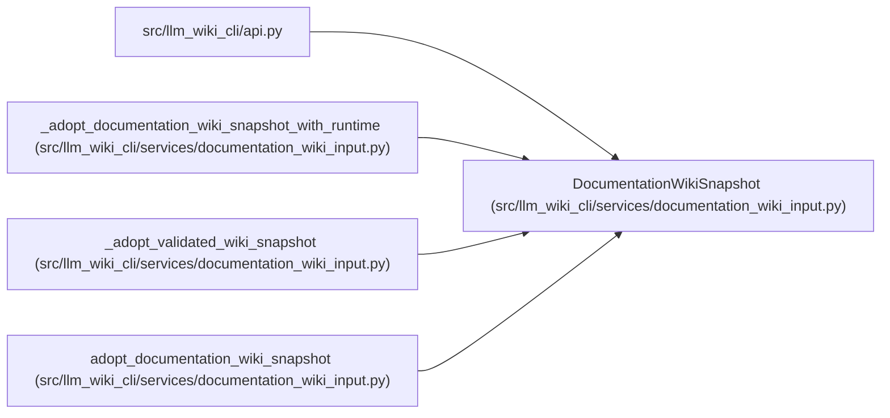

# DocumentationWikiSnapshot

**Location:** `src/llm_wiki_cli/services/documentation_wiki_input.py:231`
**Kind:** Class
**Bases:** —
**Module:** [documentation_wiki_input](../modules/documentation_wiki_input.md)

**Decorators:** `@dataclass(frozen=True)`

## Description

Typed provenance for an adopted, byte-preserved wiki snapshot.

## Attributes

| Name | Type | Default | Description |
|------|------|---------|-------------|
| `input_wiki_dir` | `str` | *required* | — |
| `workspace_wiki_dir` | `str` | *required* | — |
| `input_tree_hash` | `str` | *required* | — |
| `initial_snapshot_hash` | `str` | *required* | — |
| `file_hashes` | `Mapping[str, str]` | *required* | — |
| `copied_paths` | `tuple[str, ...]` | *required* | — |
| `manifest_schema_version` | `int \| None` | *required* | — |
| `surface_schema_version` | `str \| None` | *required* | — |
| `legacy_index_only` | `bool` | *required* | — |
| `unknown_entries` | `tuple[str, ...]` | *required* | — |
| `rejected_entries` | `tuple[str, ...]` | *required* | — |
| `generated_markers` | `Mapping[str, Any]` | *required* | — |
| `semantic_markdown_paths` | `tuple[str, ...]` | *required* | — |
| `semantic_pages` | `tuple[Mapping[str, Any], ...]` | *required* | — |
| `diagnostics` | `tuple[str, ...]` | *required* | — |
| `source_available` | `bool` | *required* | — |
| `source_root` | `str \| None` | *required* | — |
| `freshness_policy` | `str` | *required* | — |
| `freshness` | `str` | *required* | — |
| `source_mismatches` | `tuple[str, ...]` | *required* | — |
| `workspace_refresh_required` | `bool` | *required* | — |
| `resource_usage` | `Mapping[str, int]` | *required* | — |
| `resource_limits` | `Mapping[str, int]` | *required* | — |
| `knowledge_schema_version` | `str \| None` | `None` | — |
| `artifact_form` | `str` | `'legacy_index_only'` | — |
| `freshness_diagnostics` | `tuple[Mapping[str, str], ...]` | `()` | — |
| `baseline_strategy` | `str` | `field(default='adopt_existing_wiki', init=False)` | — |

## Methods

| Method | Signature | Decorators | Description |
|--------|-----------|------------|-------------|
| `source_verified_publish_ready` | `() -> bool` | `@property` | Whether this import can support a source-verified publish verdict. |
| `recognized_schemas` | `() -> dict[str, int \| str]` | `@property` | Return only metadata schemas recognized on the imported input. |
| `compatibility` | `() -> str` | `@property` | Compatibility classification used by lifecycle/status surfaces. |
| `refresh_decision` | `() -> str` | `@property` | Describe the only permitted follow-up mutation decision. |
| `to_dict` | `() -> dict[str, Any]` | — | Return a JSON-serializable evidence payload. |

## Relationships

<!-- Auto-generated relationship summary. Do not edit by hand. -->

### Summary

| Module | Methods | Attributes |
|---|---:|---|
| [documentation_wiki_input](../modules/documentation_wiki_input.md) | 5 | `artifact_form`, `baseline_strategy`, `copied_paths`, `diagnostics`, `file_hashes`, `freshness`, `freshness_diagnostics`, `freshness_policy`, `generated_markers`, `initial_snapshot_hash`, `input_tree_hash`, `input_wiki_dir` |

### References

| Reference | Kind | Source | Call sites |
|---|---|---|---:|
| `api` | import | [api](../modules/api.md) | — |
| `_adopt_documentation_wiki_snapshot_with_runtime` | type_reference | [documentation_wiki_input](../modules/documentation_wiki_input.md) | — |
| `_adopt_validated_wiki_snapshot` | call | [documentation_wiki_input](../modules/documentation_wiki_input.md) | 1 |
| `_adopt_validated_wiki_snapshot` | type_reference | [documentation_wiki_input](../modules/documentation_wiki_input.md) | — |
| `adopt_documentation_wiki_snapshot` | type_reference | [documentation_wiki_input](../modules/documentation_wiki_input.md) | — |
