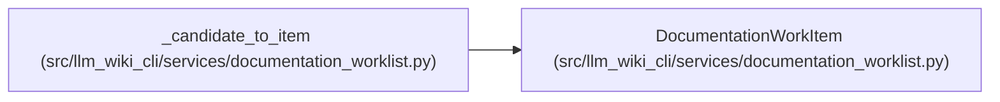

# DocumentationWorkItem

**Location:** `src/llm_wiki_cli/services/documentation_worklist.py:137`
**Kind:** Class
**Bases:** —
**Module:** [documentation_worklist](../modules/documentation_worklist.md)

**Decorators:** `@dataclass(frozen=True)`

## Description

One stable semantic-work unit or explicitly accounted reuse/deferral.

## Attributes

| Name | Type | Default | Description |
|------|------|---------|-------------|
| `work_id` | `str` | *required* | — |
| `priority` | `str` | *required* | — |
| `category` | `str` | *required* | — |
| `title` | `str` | *required* | — |
| `canonical_path` | `str \| None` | *required* | — |
| `source_path` | `str \| None` | *required* | — |
| `status` | `str` | *required* | — |
| `signals` | `tuple[str, ...]` | *required* | — |
| `suggested_context` | `tuple[str, ...]` | *required* | — |
| `acceptance_checks` | `tuple[str, ...]` | *required* | — |
| `rank_score` | `int` | `0` | — |
| `imported_classification` | `str \| None` | `None` | — |
| `reuse_eligible` | `bool` | `False` | — |
| `grounding_status` | `str` | `'unknown'` | — |
| `deferred` | `bool` | `False` | — |
| `deferral_reason` | `str \| None` | `None` | — |

## Methods

| Method | Signature | Decorators | Description |
|--------|-----------|------------|-------------|
| `to_dict` | `() -> dict[str, Any]` | — | Return a JSON-compatible representation. |

## Relationships

<!-- Auto-generated relationship summary. Do not edit by hand. -->

### Summary

| Module | Methods | Attributes |
|---|---:|---|
| [documentation_worklist](../modules/documentation_worklist.md) | 1 | `acceptance_checks`, `canonical_path`, `category`, `deferral_reason`, `deferred`, `grounding_status`, `imported_classification`, `priority`, `rank_score`, `reuse_eligible`, `signals`, `source_path` |

### References

| Reference | Kind | Source | Call sites |
|---|---|---|---:|
| `_candidate_to_item` | call | [documentation_worklist](../modules/documentation_worklist.md) | 1 |
| `_candidate_to_item` | type_reference | [documentation_worklist](../modules/documentation_worklist.md) | — |
