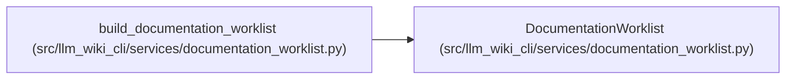

# DocumentationWorklist

**Location:** `src/llm_wiki_cli/services/documentation_worklist.py:180`
**Kind:** Class
**Bases:** —
**Module:** [documentation_worklist](../modules/documentation_worklist.md)

**Decorators:** `@dataclass(frozen=True)`

## Description

Stable semantic worklist and deterministic coverage summary.

## Attributes

| Name | Type | Default | Description |
|------|------|---------|-------------|
| `items` | `tuple[DocumentationWorkItem, ...]` | *required* | — |
| `p1_budget` | `int` | *required* | — |
| `max_context_entries` | `int` | *required* | — |
| `max_acceptance_checks` | `int` | *required* | — |
| `schema_version` | `str` | `DOCUMENTATION_WORKLIST_SCHEMA_VERSION` | — |

## Methods

| Method | Signature | Decorators | Description |
|--------|-----------|------------|-------------|
| `to_dict` | `() -> dict[str, Any]` | — | Return the portable worklist contract. |

## Relationships

<!-- Auto-generated relationship summary. Do not edit by hand. -->

### Summary

| Module | Methods | Attributes |
|---|---:|---|
| [documentation_worklist](../modules/documentation_worklist.md) | 1 | `items`, `max_acceptance_checks`, `max_context_entries`, `p1_budget`, `schema_version` |

### References

| Reference | Kind | Source | Call sites |
|---|---|---|---:|
| `build_documentation_worklist` | call | [documentation_worklist](../modules/documentation_worklist.md) | 1 |
| `build_documentation_worklist` | type_reference | [documentation_worklist](../modules/documentation_worklist.md) | — |
