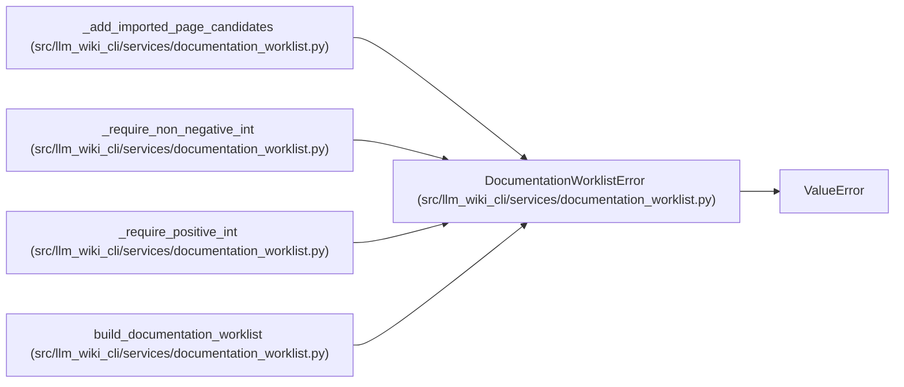

# DocumentationWorklistError

**Location:** `src/llm_wiki_cli/services/documentation_worklist.py:132`
**Kind:** Class
**Bases:** `ValueError`
**Module:** [documentation_worklist](../modules/documentation_worklist.md)

## Description

Raised when deterministic worklist inputs are invalid.

## Attributes

*No annotated attributes found.*

## Methods

*No public methods. Inherits from base classes.*

## Relationships

<!-- Auto-generated relationship summary. Do not edit by hand. -->

### Summary

| Module | Methods | Attributes |
|---|---:|---|
| [documentation_worklist](../modules/documentation_worklist.md) | 0 | — |

### Structure

| Kind | Entity | Module |
|---|---|---|
| Base | `ValueError` | — |

### References

| Reference | Kind | Source | Call sites |
|---|---|---|---:|
| `_add_imported_page_candidates` | call | [documentation_worklist](../modules/documentation_worklist.md) | 1 |
| `_require_non_negative_int` | call | [documentation_worklist](../modules/documentation_worklist.md) | 1 |
| `_require_positive_int` | call | [documentation_worklist](../modules/documentation_worklist.md) | 1 |
| `build_documentation_worklist` | call | [documentation_worklist](../modules/documentation_worklist.md) | 1 |
