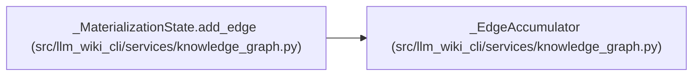

# _EdgeAccumulator

**Location:** `src/llm_wiki_cli/services/knowledge_graph.py:147`
**Kind:** Class
**Bases:** —
**Module:** [knowledge_graph](../modules/knowledge_graph.md)

**Decorators:** `@dataclass`

## Description

_Auto-generated from `_EdgeAccumulator` in `src/llm_wiki_cli/services/knowledge_graph.py`._

## Attributes

| Name | Type | Default | Description |
|------|------|---------|-------------|
| `kind` | `str` | *required* | — |
| `source` | `dict[str, Any]` | *required* | — |
| `target` | `dict[str, Any]` | *required* | — |
| `origin` | `str` | *required* | — |
| `resolution` | `str` | *required* | — |
| `aggregate_input_hash` | `str` | *required* | — |
| `evidence_limit` | `int` | *required* | — |
| `limitations` | `set[str]` | `field(default_factory=set)` | — |
| `observed` | `int` | `0` | — |
| `_samples` | `dict[str, dict[str, Any]]` | `field(default_factory=dict)` | — |

## Methods

| Method | Signature | Decorators | Description |
|--------|-----------|------------|-------------|
| `add` | `(sample: Mapping[str, Any]) -> None` | — | — |
| `payload` | `() -> dict[str, Any]` | — | — |

## Relationships

<!-- Auto-generated relationship summary. Do not edit by hand. -->

### Summary

| Module | Methods | Attributes |
|---|---:|---|
| [knowledge_graph](../modules/knowledge_graph.md) | 2 | `_samples`, `aggregate_input_hash`, `evidence_limit`, `kind`, `limitations`, `observed`, `origin`, `resolution`, `source`, `target` |

### References

| Reference | Kind | Source |
|---|---|---|
| `_MaterializationState.add_edge` | call | [knowledge_graph](../modules/knowledge_graph.md) |
