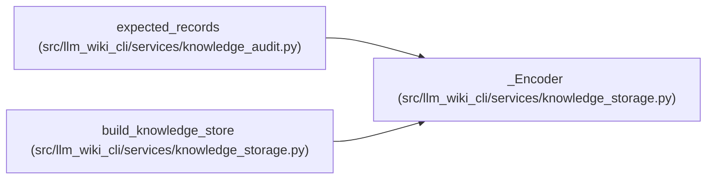

# _Encoder

**Location:** `src/llm_wiki_cli/services/knowledge_storage.py:186`
**Kind:** Class
**Bases:** —
**Module:** [knowledge_storage](../modules/knowledge_storage.md)

## Description

Encodes repeated source, target and basis values as stable references while escaping literal reserved keys. Shared snapshot values remain root bindings so unrelated record objects need not change with the generation basis.

## Attributes

*No annotated attributes found.*

## Methods

| Method | Signature | Decorators | Description |
|--------|-----------|------------|-------------|
| `__init__` | `(basis: dict[str, str])` | — | — |
| `encode` | `(value: Any, *, field: str = '', depth: int = 0) -> Any` | — | — |

## Relationships

<!-- Auto-generated relationship summary. Do not edit by hand. -->

### Summary

| Module | Methods | Attributes |
|---|---:|---|
| [knowledge_storage](../modules/knowledge_storage.md) | 2 | — |

### References

| Reference | Kind | Source | Call sites |
|---|---|---|---:|
| `expected_records` | call | [knowledge_audit](../modules/knowledge_audit.md) | 1 |
| `build_knowledge_store` | call | [knowledge_storage](../modules/knowledge_storage.md) | 1 |
