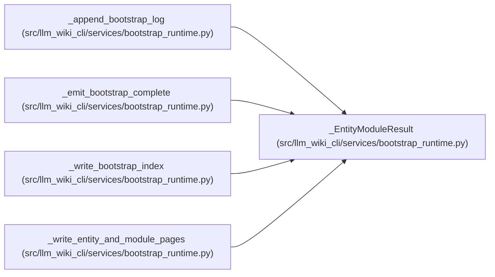

# _EntityModuleResult

**Location:** `src/llm_wiki_cli/services/bootstrap_runtime.py:4127`
**Kind:** Class
**Bases:** —
**Module:** [bootstrap_runtime](../modules/bootstrap_runtime.md)

**Decorators:** `@dataclass(frozen=True)`

## Description

_Auto-generated from `_EntityModuleResult` in `src/llm_wiki_cli/services/bootstrap_runtime.py`._

## Attributes

| Name | Type | Default | Description |
|------|------|---------|-------------|
| `all_entity_names` | `list[str]` | *required* | — |
| `module_entries` | `list[dict]` | *required* | — |
| `entities_created` | `int` | *required* | — |
| `modules_created` | `int` | *required* | — |

## Methods

*No public methods. Inherits from base classes.*

## Relationships

<!-- Auto-generated relationship summary. Do not edit by hand. -->

### Summary

| Module | Methods | Attributes |
|---|---:|---|
| [bootstrap_runtime](../modules/bootstrap_runtime.md) | 0 | `all_entity_names`, `entities_created`, `module_entries`, `modules_created` |

### References

| Reference | Kind | Source | Call sites |
|---|---|---|---:|
| `_append_bootstrap_log` | type_reference | [bootstrap_runtime](../modules/bootstrap_runtime.md) | — |
| `_emit_bootstrap_complete` | type_reference | [bootstrap_runtime](../modules/bootstrap_runtime.md) | — |
| `_write_bootstrap_index` | type_reference | [bootstrap_runtime](../modules/bootstrap_runtime.md) | — |
| `_write_entity_and_module_pages` | call | [bootstrap_runtime](../modules/bootstrap_runtime.md) | 1 |
| `_write_entity_and_module_pages` | type_reference | [bootstrap_runtime](../modules/bootstrap_runtime.md) | — |
