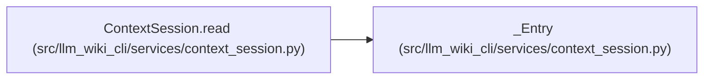

# _Entry

**Location:** `src/llm_wiki_cli/services/context_session.py:140`
**Kind:** Class
**Bases:** —
**Module:** [context_session](../modules/context_session.md)

**Decorators:** `@dataclass(frozen=True)`

## Description

Private bounded cache entry containing detached read state, environment identity, expiry and retained-size accounting. It carries optimization state without conferring authority on a portable context.

## Attributes

| Name | Type | Default | Description |
|------|------|---------|-------------|
| `read` | `TaskRead` | *required* | — |
| `environment` | `str \| None` | *required* | — |
| `expires` | `float` | *required* | — |
| `size` | `int` | *required* | — |
| `owner` | `object` | *required* | — |

## Methods

*No public methods. Inherits from base classes.*

## Relationships

<!-- Auto-generated relationship summary. Do not edit by hand. -->

### Summary

| Module | Methods | Attributes |
|---|---:|---|
| [context_session](../modules/context_session.md) | 0 | `environment`, `expires`, `owner`, `read`, `size` |

### References

| Reference | Kind | Source | Call sites |
|---|---|---|---:|
| `ContextSession.read` | call | [context_session](../modules/context_session.md) | 2 |
