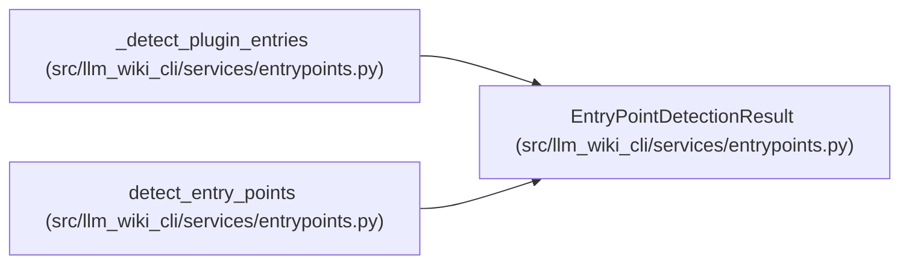

# EntryPointDetectionResult

**Location:** `src/llm_wiki_cli/services/entrypoints.py:57`
**Kind:** Class
**Bases:** —
**Module:** [entrypoints](../modules/entrypoints.md)

**Decorators:** `@dataclass(frozen=True)`

## Description

_Auto-generated from `EntryPointDetectionResult` in `src/llm_wiki_cli/services/entrypoints.py`._

## Attributes

| Name | Type | Default | Description |
|------|------|---------|-------------|
| `entries` | `list[dict]` | *required* | — |
| `warnings` | `list[str]` | *required* | — |

## Methods

*No public methods. Inherits from base classes.*

## Relationships

<!-- Auto-generated relationship summary. Do not edit by hand. -->

### Summary

| Module | Methods | Attributes |
|---|---:|---|
| [entrypoints](../modules/entrypoints.md) | 0 | `entries`, `warnings` |

### References

| Reference | Kind | Source | Call sites |
|---|---|---|---:|
| `_detect_plugin_entries` | type_reference | [entrypoints](../modules/entrypoints.md) | — |
| `detect_entry_points` | call | [entrypoints](../modules/entrypoints.md) | 1 |
| `detect_entry_points` | type_reference | [entrypoints](../modules/entrypoints.md) | — |
