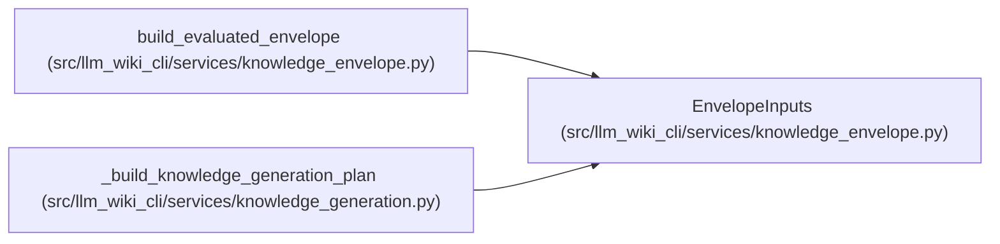

# EnvelopeInputs

**Location:** `src/llm_wiki_cli/services/knowledge_envelope.py:245`
**Kind:** Class
**Bases:** —
**Module:** [knowledge_envelope](../modules/knowledge_envelope.md)

**Decorators:** `@dataclass(frozen=True)`

## Description

Complete in-memory inputs for one evaluated envelope.

## Attributes

| Name | Type | Default | Description |
|------|------|---------|-------------|
| `repository` | `RepositoryRecord` | *required* | — |
| `source_inputs` | `tuple[ConsumedInput, ...]` | *required* | — |
| `inventory` | `Mapping[str, Any]` | *required* | — |
| `markdown_pages` | `Mapping[str, str \| bytes]` | *required* | — |
| `surface_index_bytes` | `bytes` | *required* | — |
| `generation_options` | `Mapping[str, Any]` | *required* | — |
| `generation_option_defaults` | `Mapping[str, Any]` | *required* | — |
| `generation_option_allowlist` | `tuple[str, ...]` | *required* | — |
| `tool` | `ProducerComponentInput` | *required* | — |
| `extractors` | `tuple[ProducerComponentInput, ...]` | `()` | — |
| `plugins` | `tuple[ProducerComponentInput, ...]` | `()` | — |
| `bundle_extensions` | `Mapping[str, Any]` | `field(default_factory=dict)` | — |
| `snapshot_extensions` | `Mapping[str, Any]` | `field(default_factory=dict)` | — |
| `producer_extensions` | `Mapping[str, Any]` | `field(default_factory=dict)` | — |

## Methods

*No public methods. Inherits from base classes.*

## Relationships

<!-- Auto-generated relationship summary. Do not edit by hand. -->

### Summary

| Module | Methods | Attributes |
|---|---:|---|
| [knowledge_envelope](../modules/knowledge_envelope.md) | 0 | `bundle_extensions`, `extractors`, `generation_option_allowlist`, `generation_option_defaults`, `generation_options`, `inventory`, `markdown_pages`, `plugins`, `producer_extensions`, `repository`, `snapshot_extensions`, `source_inputs` |

### References

| Reference | Kind | Source | Call sites |
|---|---|---|---:|
| `build_evaluated_envelope` | type_reference | [knowledge_envelope](../modules/knowledge_envelope.md) | — |
| `_build_knowledge_generation_plan` | call | [knowledge_generation](../modules/knowledge_generation.md) | 1 |
