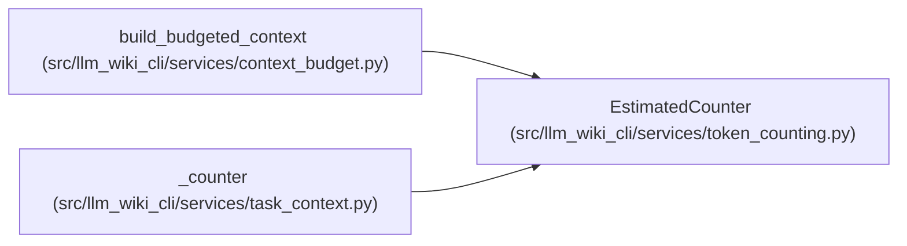

# EstimatedCounter

**Location:** `src/llm_wiki_cli/services/token_counting.py:17`
**Kind:** Class
**Bases:** —
**Module:** [token_counting](../modules/token_counting.md)

## Description

_Auto-generated from `EstimatedCounter` in `src/llm_wiki_cli/services/token_counting.py`._

## Attributes

*No annotated attributes found.*

## Methods

| Method | Signature | Decorators | Description |
|--------|-----------|------------|-------------|
| `count` | `(text: str) -> int` | — | — |

## Relationships

<!-- Auto-generated relationship summary. Do not edit by hand. -->

### Summary

| Module | Methods | Attributes |
|---|---:|---|
| [token_counting](../modules/token_counting.md) | 1 | — |

### References

| Reference | Kind | Source | Call sites |
|---|---|---|---:|
| `build_budgeted_context` | call | [context_budget](../modules/context_budget.md) | 1 |
| `_counter` | call | [task_context](../modules/task_context.md) | 1 |
