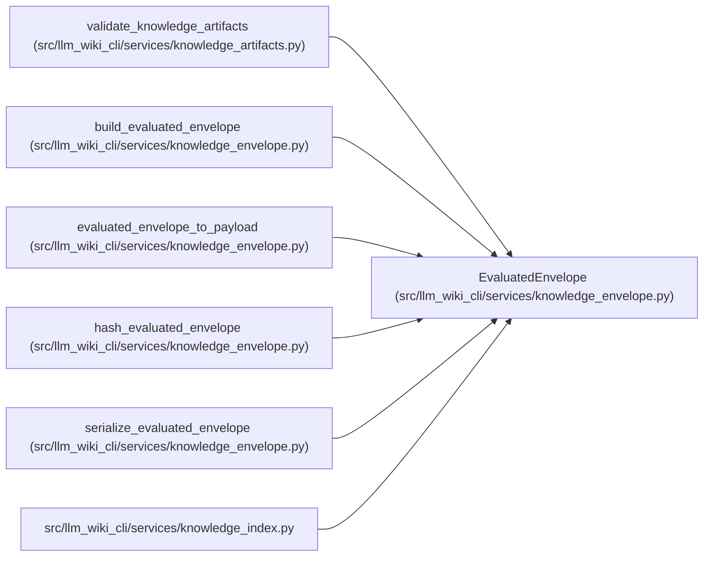

# EvaluatedEnvelope

**Location:** `src/llm_wiki_cli/services/knowledge_envelope.py:263`
**Kind:** Class
**Bases:** —
**Module:** [knowledge_envelope](../modules/knowledge_envelope.md)

**Decorators:** `@dataclass(frozen=True)`

## Description

Version-tagged evaluated basis committed through manifest v5.

## Attributes

| Name | Type | Default | Description |
|------|------|---------|-------------|
| `bundle` | `BundleRecord` | *required* | — |
| `schema_version` | `str` | `EVALUATED_ENVELOPE_VERSION` | — |

## Methods

| Method | Signature | Decorators | Description |
|--------|-----------|------------|-------------|
| `inventory_hash` | `() -> str` | `@property` | — |
| `to_payload` | `() -> dict[str, Any]` | — | — |
| `to_json` | `() -> str` | — | — |
| `content_hash` | `() -> str` | — | — |

## Relationships

<!-- Auto-generated relationship summary. Do not edit by hand. -->

### Summary

| Module | Methods | Attributes |
|---|---:|---|
| [knowledge_envelope](../modules/knowledge_envelope.md) | 4 | `bundle`, `schema_version` |

### References

| Reference | Kind | Source |
|---|---|---|
| `validate_knowledge_artifacts` | call | [knowledge_artifacts](../modules/knowledge_artifacts.md) |
| `build_evaluated_envelope` | call | [knowledge_envelope](../modules/knowledge_envelope.md) |
| `build_evaluated_envelope` | type_reference | [knowledge_envelope](../modules/knowledge_envelope.md) |
| `evaluated_envelope_to_payload` | type_reference | [knowledge_envelope](../modules/knowledge_envelope.md) |
| `hash_evaluated_envelope` | type_reference | [knowledge_envelope](../modules/knowledge_envelope.md) |
| `serialize_evaluated_envelope` | type_reference | [knowledge_envelope](../modules/knowledge_envelope.md) |
| `knowledge_index` | import | [knowledge_index](../modules/knowledge_index.md) |
