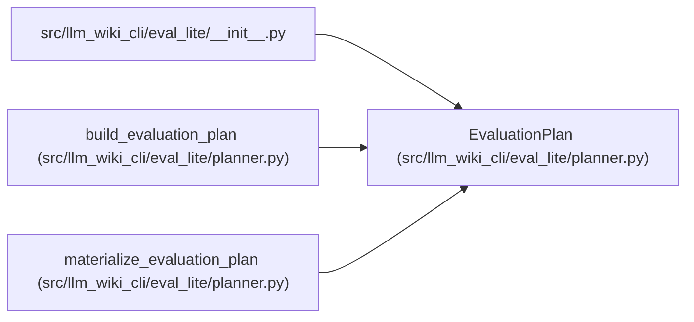

# EvaluationPlan

**Location:** `src/llm_wiki_cli/eval_lite/planner.py:73`
**Kind:** Class
**Bases:** —
**Module:** [planner](../modules/planner.md)

**Decorators:** `@dataclass(frozen=True)`

## Description

An immutable canonical inspection plan.

## Attributes

| Name | Type | Default | Description |
|------|------|---------|-------------|
| `_canonical_bytes` | `bytes` | *required* | — |
| `_payload` | `Mapping[str, Any]` | *required* | — |

## Methods

| Method | Signature | Decorators | Description |
|--------|-----------|------------|-------------|
| `plan_digest` | `() -> str` | `@property` | — |
| `disposition` | `() -> str` | `@property` | — |
| `to_bytes` | `() -> bytes` | — | Return canonical sorted-key UTF-8 JSON ending in one LF. |
| `to_payload` | `() -> dict[str, Any]` | — | Return a detached JSON-compatible plan value. |

## Relationships

<!-- Auto-generated relationship summary. Do not edit by hand. -->

### Summary

| Module | Methods | Attributes |
|---|---:|---|
| [planner](../modules/planner.md) | 4 | `_canonical_bytes`, `_payload` |

### References

| Reference | Kind | Source | Call sites |
|---|---|---|---:|
| `__init__` | import | [eval_lite___init__](../modules/eval_lite___init__.md) | — |
| `build_evaluation_plan` | call | [planner](../modules/planner.md) | 1 |
| `build_evaluation_plan` | type_reference | [planner](../modules/planner.md) | — |
| `materialize_evaluation_plan` | type_reference | [planner](../modules/planner.md) | — |
