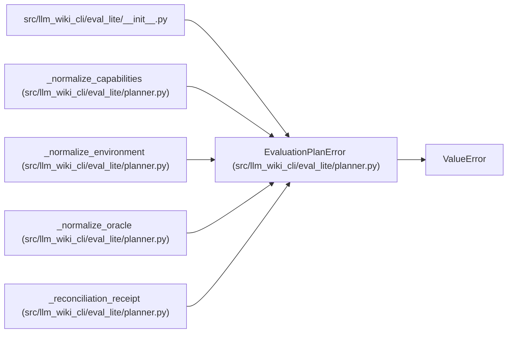

# EvaluationPlanError

**Location:** `src/llm_wiki_cli/eval_lite/planner.py:63`
**Kind:** Class
**Bases:** `ValueError`
**Module:** [planner](../modules/planner.md)

## Description

A task manifest, packet input, or capability declaration is invalid.

## Attributes

*No annotated attributes found.*

## Methods

| Method | Signature | Decorators | Description |
|--------|-----------|------------|-------------|
| `__init__` | `(field: str, message: str)` | — | — |

## Relationships

<!-- Auto-generated relationship summary. Do not edit by hand. -->

### Summary

| Module | Methods | Attributes |
|---|---:|---|
| [planner](../modules/planner.md) | 1 | — |

### Structure

| Kind | Entity | Module |
|---|---|---|
| Base | `ValueError` | — |

### References

| Reference | Kind | Source |
|---|---|---|
| `__init__` | import | [eval_lite___init__](../modules/eval_lite___init__.md) |
| `_normalize_capabilities` | call | [planner](../modules/planner.md) |
| `_normalize_capabilities` | call | [planner](../modules/planner.md) |
| `_normalize_capabilities` | call | [planner](../modules/planner.md) |
| `_normalize_capabilities` | call | [planner](../modules/planner.md) |
| `_normalize_capabilities` | call | [planner](../modules/planner.md) |
| `_normalize_environment` | call | [planner](../modules/planner.md) |
| `_normalize_environment` | call | [planner](../modules/planner.md) |
| `_normalize_environment` | call | [planner](../modules/planner.md) |
| `_normalize_oracle` | call | [planner](../modules/planner.md) |
| `_normalize_oracle` | call | [planner](../modules/planner.md) |
| `_reconciliation_receipt` | call | [planner](../modules/planner.md) |
