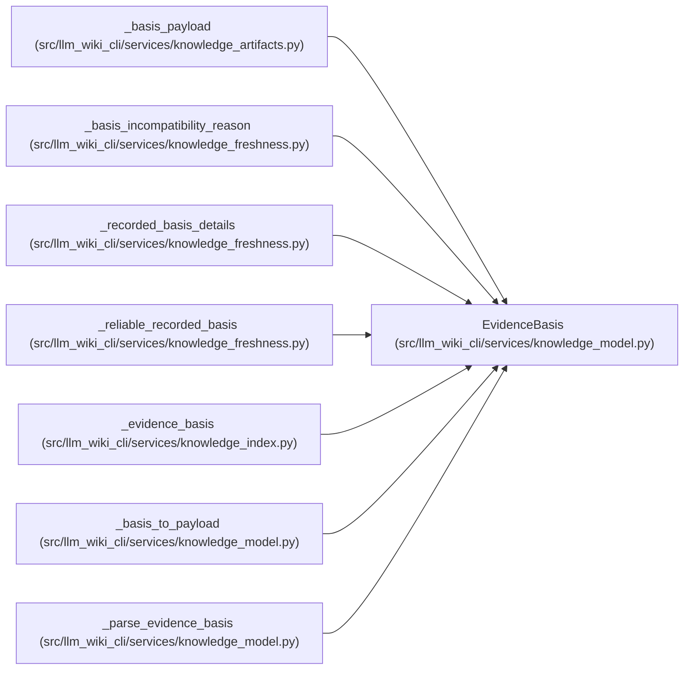

# EvidenceBasis

**Location:** `src/llm_wiki_cli/services/knowledge_model.py:336`
**Kind:** Class
**Bases:** —
**Module:** [knowledge_model](../modules/knowledge_model.md)

**Decorators:** `@dataclass(frozen=True)`

## Description

_Auto-generated from `EvidenceBasis` in `src/llm_wiki_cli/services/knowledge_model.py`._

## Attributes

| Name | Type | Default | Description |
|------|------|---------|-------------|
| `scope` | `ObservationScope` | *required* | — |
| `source_path` | `Optional[str]` | `None` | — |
| `extractor_ref` | `Optional[str]` | `None` | — |
| `source_content_hash` | `Optional[str]` | `None` | — |
| `concept_observation_hash` | `Optional[str]` | `None` | — |
| `aggregate_input_hash` | `Optional[str]` | `None` | — |
| `extensions` | `Extensions` | `field(default_factory=dict)` | — |

## Methods

*No public methods. Inherits from base classes.*

## Relationships

<!-- Auto-generated relationship summary. Do not edit by hand. -->

### Summary

| Module | Methods | Attributes |
|---|---:|---|
| [knowledge_model](../modules/knowledge_model.md) | 0 | `aggregate_input_hash`, `concept_observation_hash`, `extensions`, `extractor_ref`, `scope`, `source_content_hash`, `source_path` |

### References

| Reference | Kind | Source |
|---|---|---|
| `_basis_payload` | type_reference | [knowledge_artifacts](../modules/knowledge_artifacts.md) |
| `_basis_incompatibility_reason` | type_reference | [knowledge_freshness](../modules/knowledge_freshness.md) |
| `_recorded_basis_details` | type_reference | [knowledge_freshness](../modules/knowledge_freshness.md) |
| `_reliable_recorded_basis` | type_reference | [knowledge_freshness](../modules/knowledge_freshness.md) |
| `_evidence_basis` | call | [knowledge_index](../modules/knowledge_index.md) |
| `_evidence_basis` | type_reference | [knowledge_index](../modules/knowledge_index.md) |
| `_basis_to_payload` | type_reference | [knowledge_model](../modules/knowledge_model.md) |
| `_parse_evidence_basis` | call | [knowledge_model](../modules/knowledge_model.md) |
| `_parse_evidence_basis` | type_reference | [knowledge_model](../modules/knowledge_model.md) |
