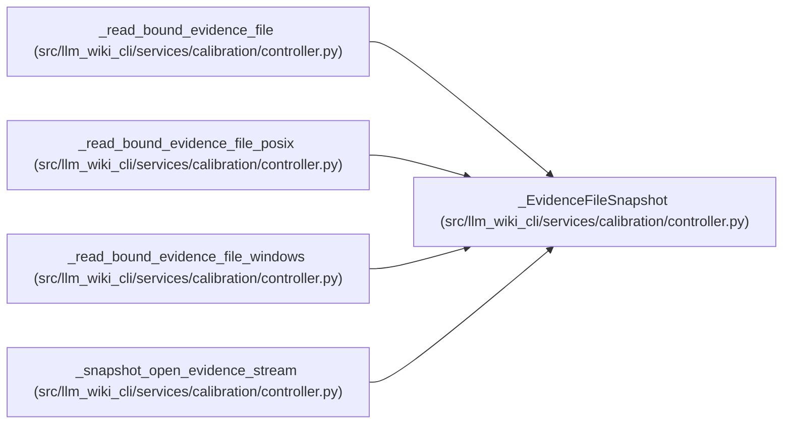

# _EvidenceFileSnapshot

**Location:** `src/llm_wiki_cli/services/calibration/controller.py:250`
**Kind:** Class
**Bases:** —
**Module:** [controller](../modules/controller.md)

**Decorators:** `@dataclass(frozen=True)`

## Description

Bytes, size, and hashes derived from one pinned evidence handle.

## Attributes

| Name | Type | Default | Description |
|------|------|---------|-------------|
| `included` | `bytes` | *required* | — |
| `original_bytes` | `int` | *required* | — |
| `sha256` | `str` | *required* | — |
| `included_sha256` | `str` | *required* | — |
| `truncated` | `bool` | *required* | — |

## Methods

*No public methods. Inherits from base classes.*

## Relationships

<!-- Auto-generated relationship summary. Do not edit by hand. -->

### Summary

| Module | Methods | Attributes |
|---|---:|---|
| [controller](../modules/controller.md) | 0 | `included`, `included_sha256`, `original_bytes`, `sha256`, `truncated` |

### References

| Reference | Kind | Source | Call sites |
|---|---|---|---:|
| `_read_bound_evidence_file` | type_reference | [controller](../modules/controller.md) | — |
| `_read_bound_evidence_file_posix` | type_reference | [controller](../modules/controller.md) | — |
| `_read_bound_evidence_file_windows` | type_reference | [controller](../modules/controller.md) | — |
| `_snapshot_open_evidence_stream` | call | [controller](../modules/controller.md) | 1 |
| `_snapshot_open_evidence_stream` | type_reference | [controller](../modules/controller.md) | — |
