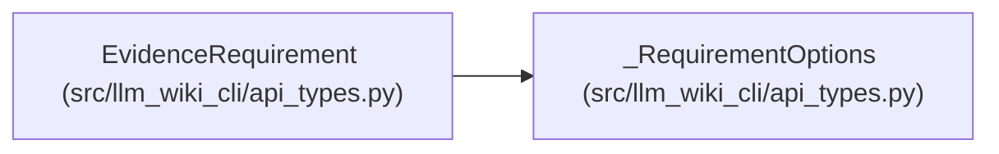

# EvidenceRequirement

**Location:** `src/llm_wiki_cli/api_types.py:26`
**Kind:** Class
**Bases:** `_RequirementOptions`
**Module:** [api_types](../modules/api_types.md)

## Description

Identifies one observable evidence requirement by stable ID, facet, selector and criterion. Satisfaction concerns the emitted observation under its qualifiers; behavioral correctness and semantic adequacy remain separate host judgments.

## Attributes

| Name | Type | Presence | Description |
|------|------|----------|-------------|
| `id` | `str` | *required* | — |
| `facet` | `Literal['source-contract', 'callers', 'callees', 'concept', 'semantic-section', 'typed-relationships', 'entrypoint', 'dependency', 'behavior']` | *required* | — |
| `selector` | `str` | *required* | — |

## Methods

*No public methods. Inherits from base classes.*

## Relationships

<!-- Auto-generated relationship summary. Do not edit by hand. -->

### Summary

| Module | Methods | Attributes |
|---|---:|---|
| [api_types](../modules/api_types.md) | 0 | `facet`, `id`, `selector` |

### Structure

| Kind | Entity | Module |
|---|---|---|
| Base | `_RequirementOptions` | [api_types](../modules/api_types.md) |