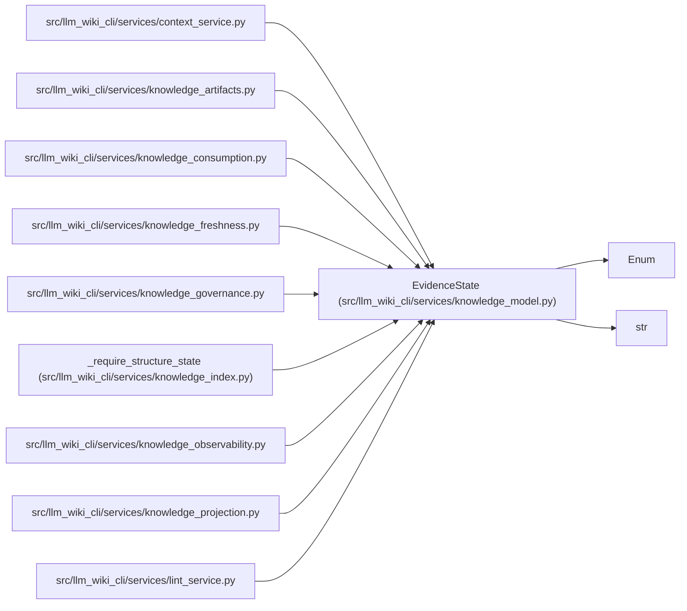

# EvidenceState

**Location:** `src/llm_wiki_cli/services/knowledge_model.py:125`
**Kind:** Enum
**Bases:** `str`, `Enum`
**Module:** [knowledge_model](../modules/knowledge_model.md)

## Description

_Auto-generated from `EvidenceState` in `src/llm_wiki_cli/services/knowledge_model.py`._

## Attributes

| Name | Declared value | Description |
|------|-------|-------------|
| `UNKNOWN` | `'unknown'` | — |
| `PRESENT` | `'present'` | — |
| `MISSING` | `'missing'` | — |
| `INVALID` | `'invalid'` | — |
| `NOT_APPLICABLE` | `'not-applicable'` | — |

## Methods

*No public methods. Inherits from base classes.*

## Relationships

<!-- Auto-generated relationship summary. Do not edit by hand. -->

### Summary

| Module | Methods | Attributes |
|---|---:|---|
| [knowledge_model](../modules/knowledge_model.md) | 0 | `INVALID`, `MISSING`, `NOT_APPLICABLE`, `PRESENT`, `UNKNOWN` |

### Structure

| Kind | Entity | Module |
|---|---|---|
| Base | `Enum` | — |
| Base | `str` | — |

### References

| Reference | Kind | Source |
|---|---|---|
| `context_service` | import | [context_service](../modules/context_service.md) |
| `knowledge_artifacts` | import | [knowledge_artifacts](../modules/knowledge_artifacts.md) |
| `knowledge_consumption` | import | [knowledge_consumption](../modules/knowledge_consumption.md) |
| `knowledge_freshness` | import | [knowledge_freshness](../modules/knowledge_freshness.md) |
| `knowledge_governance` | import | [knowledge_governance](../modules/knowledge_governance.md) |
| `_require_structure_state` | type_reference | [knowledge_index](../modules/knowledge_index.md) |
| `knowledge_observability` | import | [knowledge_observability](../modules/knowledge_observability.md) |
| `knowledge_projection` | import | [knowledge_projection](../modules/knowledge_projection.md) |
| `lint_service` | import | [lint_service](../modules/lint_service.md) |
