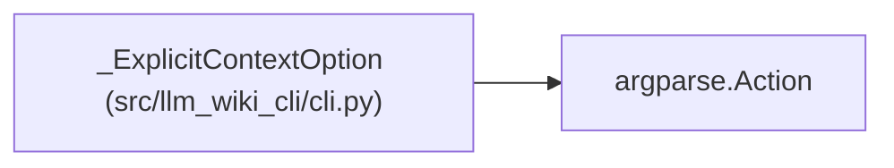

# _ExplicitContextOption

**Location:** `src/llm_wiki_cli/cli.py:57`
**Kind:** Class
**Bases:** `argparse.Action`
**Module:** [cli](../modules/cli.md)

## Description

Retain which semantic options were supplied beside a request file.

## Attributes

*No annotated attributes found.*

## Methods

| Method | Signature | Decorators | Description |
|--------|-----------|------------|-------------|
| `__call__` | `(parser, namespace, values, option_string = None)` | — | — |

## Relationships

<!-- Auto-generated relationship summary. Do not edit by hand. -->

### Summary

| Module | Methods | Attributes |
|---|---:|---|
| [cli](../modules/cli.md) | 1 | — |

### Structure

| Kind | Entity | Module |
|---|---|---|
| Base | `argparse.Action` | — |
