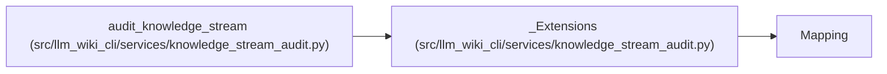

# _Extensions

**Location:** `src/llm_wiki_cli/services/knowledge_stream_audit.py:56`
**Kind:** Class
**Bases:** `Mapping`
**Module:** [knowledge_stream_audit](../modules/knowledge_stream_audit.md)

## Description

_Auto-generated from `_Extensions` in `src/llm_wiki_cli/services/knowledge_stream_audit.py`._

## Attributes

*No annotated attributes found.*

## Methods

| Method | Signature | Decorators | Description |
|--------|-----------|------------|-------------|
| `__init__` | `(stored, extra)` | — | — |
| `__iter__` | `()` | — | — |
| `__len__` | `()` | — | — |
| `__getitem__` | `(name)` | — | — |

## Relationships

<!-- Auto-generated relationship summary. Do not edit by hand. -->

### Summary

| Module | Methods | Attributes |
|---|---:|---|
| [knowledge_stream_audit](../modules/knowledge_stream_audit.md) | 4 | — |

### Structure

| Kind | Entity | Module |
|---|---|---|
| Base | `Mapping` | — |

### References

| Reference | Kind | Source | Call sites |
|---|---|---|---:|
| `audit_knowledge_stream` | call | [knowledge_stream_audit](../modules/knowledge_stream_audit.md) | 1 |
