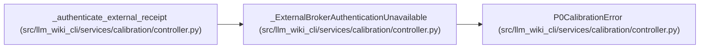

# _ExternalBrokerAuthenticationUnavailable

**Location:** `src/llm_wiki_cli/services/calibration/controller.py:245`
**Kind:** Class
**Bases:** `P0CalibrationError`
**Module:** [controller](../modules/controller.md)

## Description

Raised when external receipt authentication cannot be performed.

## Attributes

*No annotated attributes found.*

## Methods

*No public methods. Inherits from base classes.*

## Relationships

<!-- Auto-generated relationship summary. Do not edit by hand. -->

### Summary

| Module | Methods | Attributes |
|---|---:|---|
| [controller](../modules/controller.md) | 0 | — |

### Structure

| Kind | Entity | Module |
|---|---|---|
| Base | `P0CalibrationError` | [controller](../modules/controller.md) |

### References

| Reference | Kind | Source | Call sites |
|---|---|---|---:|
| `_authenticate_external_receipt` | call | [controller](../modules/controller.md) | 2 |
