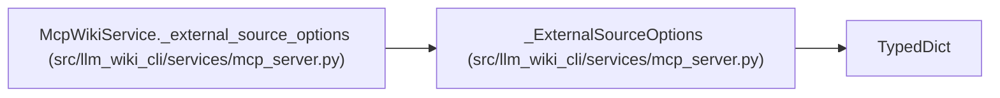

# _ExternalSourceOptions

**Location:** `src/llm_wiki_cli/services/mcp_server.py:222`
**Kind:** Class
**Bases:** `TypedDict`
**Module:** [mcp_server](../modules/mcp_server.md)

## Description

_Auto-generated from `_ExternalSourceOptions` in `src/llm_wiki_cli/services/mcp_server.py`._

## Attributes

| Name | Type | Default | Description |
|------|------|---------|-------------|
| `allow_external_src` | `bool` | *required* | — |

## Methods

*No public methods. Inherits from base classes.*

## Relationships

<!-- Auto-generated relationship summary. Do not edit by hand. -->

### Summary

| Module | Methods | Attributes |
|---|---:|---|
| [mcp_server](../modules/mcp_server.md) | 0 | `allow_external_src` |

### Structure

| Kind | Entity | Module |
|---|---|---|
| Base | `TypedDict` | — |

### References

| Reference | Kind | Source |
|---|---|---|
| `McpWikiService._external_source_options` | type_reference | [mcp_server](../modules/mcp_server.md) |
