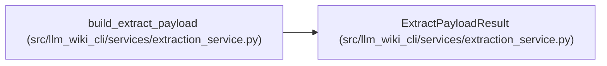

# ExtractPayloadResult

**Location:** `src/llm_wiki_cli/services/extraction_service.py:192`
**Kind:** Class
**Bases:** —
**Module:** [extraction_service](../modules/extraction_service.md)

**Decorators:** `@dataclass(frozen=True)`

## Description

_Auto-generated from `ExtractPayloadResult` in `src/llm_wiki_cli/services/extraction_service.py`._

## Attributes

| Name | Type | Default | Description |
|------|------|---------|-------------|
| `payload` | `dict` | *required* | — |
| `inventory_count` | `int` | *required* | — |
| `docker_count` | `int` | *required* | — |
| `changed_file_count` | `int \| None` | `None` | — |
| `no_changed_files` | `bool` | `False` | — |
| `inventory_result` | `InventoryResult \| None` | `field(default=None, repr=False, compare=False, kw_only=True)` | — |
| `dependency_analysis` | `dict \| None` | `field(default=None, repr=False, compare=False, kw_only=True)` | — |

## Methods

*No public methods. Inherits from base classes.*

## Relationships

<!-- Auto-generated relationship summary. Do not edit by hand. -->

### Summary

| Module | Methods | Attributes |
|---|---:|---|
| [extraction_service](../modules/extraction_service.md) | 0 | `changed_file_count`, `dependency_analysis`, `docker_count`, `inventory_count`, `inventory_result`, `no_changed_files`, `payload` |

### References

| Reference | Kind | Source |
|---|---|---|
| `build_extract_payload` | call | [extraction_service](../modules/extraction_service.md) |
| `build_extract_payload` | call | [extraction_service](../modules/extraction_service.md) |
| `build_extract_payload` | type_reference | [extraction_service](../modules/extraction_service.md) |
