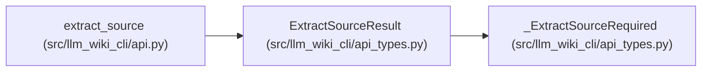

# ExtractSourceResult

**Location:** `src/llm_wiki_cli/api_types.py:96`
**Kind:** Class
**Bases:** `_ExtractSourceRequired`
**Module:** [api_types](../modules/api_types.md)

## Description

Top-level ``extract_source`` payload.

## Attributes

| Name | Type | Presence | Description |
|------|------|----------|-------------|
| `docker` | `dict[str, Any]` | *optional* | — |
| `unsupported_sources` | `dict[str, Any]` | *optional* | — |
| `entrypoints` | `list[dict[str, Any]]` | *optional* | — |
| `data_flows` | `list[dict[str, Any]]` | *optional* | — |
| `dependencies` | `dict[str, Any]` | *optional* | — |
| `api_contracts` | `dict[str, Any]` | *optional* | — |
| `warnings` | `list[str]` | *optional* | — |

## Methods

*No public methods. Inherits from base classes.*

## Relationships

<!-- Auto-generated relationship summary. Do not edit by hand. -->

### Summary

| Module | Methods | Attributes |
|---|---:|---|
| [api_types](../modules/api_types.md) | 0 | `api_contracts`, `data_flows`, `dependencies`, `docker`, `entrypoints`, `unsupported_sources`, `warnings` |

### Structure

| Kind | Entity | Module |
|---|---|---|
| Base | `_ExtractSourceRequired` | [api_types](../modules/api_types.md) |

### References

| Reference | Kind | Source | Call sites |
|---|---|---|---:|
| `extract_source` | type_reference | [api](../modules/api.md) | — |
