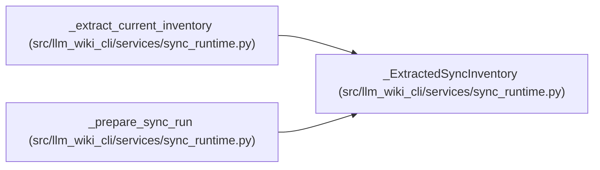

# _ExtractedSyncInventory

**Location:** `src/llm_wiki_cli/services/sync_runtime.py:1825`
**Kind:** Class
**Bases:** —
**Module:** [sync_runtime](../modules/sync_runtime.md)

**Decorators:** `@dataclass(frozen=True)`

## Description

_Auto-generated from `_ExtractedSyncInventory` in `src/llm_wiki_cli/services/sync_runtime.py`._

## Attributes

| Name | Type | Default | Description |
|------|------|---------|-------------|
| `result` | `InventoryResult` | *required* | — |
| `source_snapshot` | `SourceSnapshot` | *required* | — |

## Methods

*No declared methods.*

## Relationships

<!-- Auto-generated relationship summary. Do not edit by hand. -->

```mermaid
flowchart LR
    n0["_ExtractedSyncInventory (src/llm_wiki_cli/services/sync_runtime.py)"]
    n1["_extract_current_inventory (src/llm_wiki_cli/services/sync_runtime.py)"]
    n2["_prepare_sync_run (src/llm_wiki_cli/services/sync_runtime.py)"]
    n1 --> n0
    n2 --> n0
    click n0 "../modules/sync_runtime.md"
    click n1 "../modules/sync_runtime.md"
    click n2 "../modules/sync_runtime.md"
```

### Summary

| Module | Methods | Attributes |
|---|---:|---|
| [sync_runtime](../modules/sync_runtime.md) | 0 | `result`, `source_snapshot` |

### References

| Reference | Kind | Source | Call sites |
|---|---|---|---:|
| `_extract_current_inventory` | call | [sync_runtime](../modules/sync_runtime.md) | 1 |
| `_extract_current_inventory` | type_reference | [sync_runtime](../modules/sync_runtime.md) | — |
| `_prepare_sync_run` | call | [sync_runtime](../modules/sync_runtime.md) | 1 |
